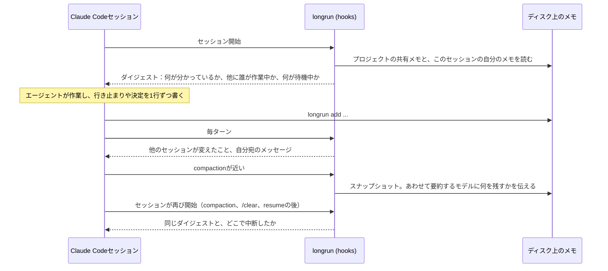

[English](README.md) | [Русский](README.ru.md) | [简体中文](README.zh-CN.md) | 日本語

<p align="center">
  
</p>

<h1 align="center">longrun</h1>

<p align="center">
  Claude Codeセッションのための記憶と協調。<br>
  compaction（会話履歴が自動で要約されること）を生き延びるメモ。メッセージを送り合い、タスクを渡し合うセッション。<br>
  寝過ごさない待機：ポーリングループはなく、イベントの発火でセッションが目を覚まします。<br>
  残りのセッションを目標まで導く、1つのセッション。
</p>

<p align="center">
  <a href="#クイックスタート">クイックスタート</a> ·
  <a href="#セッションが協調する4つの方法">4つの協調方法</a> ·
  <a href="#仕組み">仕組み</a> ·
  <a href="#コマンド">コマンド</a> ·
  <a href="docs/REFERENCE.md">リファレンス</a> ·
  <a href="https://krllx.github.io/longrun/course/ja/">コース</a>
</p>

<p align="center">
  
  
  
  
  
  
</p>

<p align="center">
  <a href="https://krllx.github.io/longrun/course/ja/"></a>
</p>

---

> 英語版がソースであり、このページより先を行っている場合があります。修正の指摘は歓迎です。[docs/TRANSLATION.md](docs/TRANSLATION.md)をご覧ください。

## クイックスタート

```bash
curl -fsSL https://raw.githubusercontent.com/krllx/longrun/main/install.sh | bash
```

> [!NOTE]
> インストーラーが入れるのは、ターミナル用の`longrun`コマンドを持つskill、`~/.claude/settings.json`のhook、そしてバックグラウンドで5分ごとに動くタイマーです。デスクトップ通知については、設定する前に尋ねます。`install.sh --uninstall`ですべて元に戻せます。

<details>
<summary>このマシンで実際に何が変わるか</summary>

- `~/.claude/settings.json`：11個のhookエントリと、エージェントが`longrun`を呼べるようにする2つの権限ルール。先にファイルを`~/.claude/backups/`へコピーし、longrunのものではないhookには手を触れません。
- `~/.claude/skills/longrun/`と、シンボリックリンク`~/.local/bin/longrun`。
- ユーザースコープのMCPサーバー`longrun`（`claude mcp add`）。`ask`と`notify`のツールはここから来ます。
- **バックグラウンドのタイマー**、5分ごと：macOSではlaunchd agent、Linuxではsystemd user timerかcronの1行。登録したウォッチを確認し、セッションの様子を見ます。数回のシェルチェックだけで、モデルもtokenも使わず、登録した条件のどれかが成立したときだけセッションを起こします。`--no-timer`で省けます。
- **デスクトップ通知**、質問に「はい」と答えた場合：macOSでは`terminal-notifier`がなければ`brew install terminal-notifier`、`~/.claude/longrun/notifier/`以下に送信用のバンドル、そしてmacOSに権限を尋ねさせるためのテスト通知が1つ。Linuxでは`notify-send`があるかを確認するだけです。`--notify`と`--no-notify`は、この質問にあらかじめ答えておくためのものです。

macOSまたはLinux、Claude Code、python3 3.9以上が必要です。cloneから入れる場合も同じ[`install.sh`](install.sh)です。

</details>

あとはClaude Codeでプロジェクトを開き（すでに開いているものでかまいません）、「**set up longrun**」と言うだけです。ターミナルからなら：

```bash
cd ~/my-project && longrun init && claude "set up longrun"
```

ここから先は、呼ぶコマンドはありません。「*記録しておいて*」、「*これまで何を試したか*」、「*PRがマージされたら教えて*」と言うだけです。

> **中身の仕組みを例つきで**：[コース](https://krllx.github.io/longrun/course/ja/)、11の短い章、約15分。

<details>
<summary><b>デスクトップ通知</b>：何のためにあり、インストーラーは何を尋ねるのか</summary>

- **なぜ**：全停止、発火したウォッチ、終わったターンは、通知がなくてもセッションに届きます。バナーは、別のウィンドウを見ているときにそれへ気づくための手段です。longrunが通知に依存することはありません。
- **macOS**：Homebrew経由の`terminal-notifier`（OS標準の手段ではバナーが表示されません）と、権限の確認が1回。インストール時に断ったなら、あとから`longrun notify setup`で入れられます。
- **Linux**：`notify-send` (`libnotify`)。たいていのデスクトップ環境にはすでに入っています。

`longrun notify --test`は、通知が実際に画面へ届くかを確かめます。見ておく価値のある設定が2つ。`notify_turn_end unfocused`（Claudeのウィンドウが前面にないときにセッションがターンを終えるとバナーを出す）と、絶対に見逃したくない1つのセッションのための`longrun important on|next`です。エージェントが呼ぶ`notify`ツールは、インストーラーが登録する`longrun` MCPサーバーから来ます。macOS特有の癖も含めた全体像は[docs/REFERENCE.md](docs/REFERENCE.md)にあります。

</details>

## ひとことで

**何も言わなくても、最初のセッションから**：エージェントは行き止まり・決定・事実をメモとしてディスクに書き、hookがそれをcompaction、`/clear`、resumeのたびに戻します。要約するモデルには何を残すかを伝えます。毎ターン、プロジェクトの他のセッションが何を変えたかが表示されます。

**頼んだとき、またはエージェントが必要だと見て取ったとき**：「PRがマージされたら教えて」（待つ間tokenを使わないウォッチ）、セッション間のメッセージとタスク、気にしているセッションが終わったときの通知、1つのセッションが他を目標へ導く動き。

## なぜ

| longrunがない場合 | longrunがある場合 |
|---|---|
| compactionは履歴を要約に押し込めます。真っ先に消えるのは「何を試して、なぜ駄目だったか」です。30分後、エージェントは自分がすでに差し戻した修正をまた提案します。 | **ディスク上のメモ**。行き止まり・決定・事実を1行ずつ。共有メモは全セッションから見え、自分のメモはcompaction、`/clear`、resumeのたびに戻ってきます。 |
| 2つ目のセッションは1つ目の存在を知りません。片方がPRを作ったのに、もう片方は「PRはまだ作られていない」と言います。 | **メッセージとタスク**。セッションがメッセージを送るかタスクを渡すと、相手のセッションにはユーザーのターンとして届きます。 |
| 「PRがマージされたら教えて」は、tokenを燃やすポーリングループになるか、寝過ごすsleepになります。 | **ウォッチ**。launchdが5分ごとにモデルなしで条件を確かめ、成立したらセッションを起こします。確実で、反応が速く、コストはゼロです。 |
| 1つのプロジェクトに5つのセッション。何が終わり、何が詰まり、次が何かを知っているのは人間だけです。 | **オーケストレーター**。1つのセッションがボードを持ち、タスクを配り、停滞している仲間を見つけ、どうしても必要なときだけダイアログで人間に尋ねます。 |

pythonファイル1つ、依存なし。

## セッションが協調する4つの方法

> [!NOTE]
> 以下のコマンドは、エージェントが自分のために実行するものです。いつメモを書き、いつメッセージを送り、いつウォッチを仕掛けるかはskillが指示します。ここに覚えるべきコマンドは1つもありません。「*記録しておいて*」や「*PRがマージされたら教えて*」と言うだけ、あるいは何も言わなくてかまいません。並べてあるのは、手で実行したくなったときにいつでも実行できるからです。

### 1. ディスク上の共有ドキュメント

プロジェクトごとに1つの`.longrun/`が、全セッションから見えるメモを持ちます。各セッションは自分のメモも、リポジトリのツリーの外に持ちます。hookはcompaction、`/clear`、resumeのたびに両方を戻し、毎ターン他のセッションが何を変えたかを表示します。

```bash
longrun add --shared -t pin "PR 42 = branch feature/checkout"     # for every session
longrun add -t dead "retry on 429 does not help, limit is per org"  # for this one
longrun recall 429                                                  # search everything
```

### 2. コンテキストを持っているセッションへの委譲

他のセッションへのメッセージは、そこではユーザーのターンとして届きます。動いているセッションはsocket経由ですぐに受け取ります。止まっているセッションは、次のターンでプロジェクトの受信箱から受け取ります。`--resume`を付けたときだけその場で起こされ、これはバックグラウンドの`claude -p`実行なのでtokenを使います。セッションの名前は、サイドバーに表示されているタイトルです。

```bash
longrun send "PR 43: payments" "PR 42 merged, rebase onto main"
longrun board assign T8 "PR 43: payments"      # a task instead of a message
```

### 3. 反応性：tokenを使わずに待つ

ウォッチとは、タイマーが5分ごとにモデルなしで実行する決定的なチェックです（macOSではlaunchd agent、Linuxではsystemd user timerかcronジョブ）。条件が成立すると、セッションはその文面をメッセージとして受け取ります。ノートPCがスリープしていても、チェックが遅れるだけです。

```bash
longrun watch add --to "PR 43: payments" --then "rebase onto main" -- pr-merged 42
longrun watch add --then "check the deploy" -- at 10:00
```

チェックの種類：`pr-merged`（`gh`経由のGitHub）、`pr-status`、`at`、`file`、`http`、`cmd`。

### 4. 選択的な自律：1つのセッションが他を導く

1つのセッションがオーケストレーターの役を引き受け、ボードを持ちます。目標、タスク、外から来た事実です。作業役のセッションはタスクを取り、終わらせ、詰まったら報告します。その動きのたびにオーケストレーターが目を覚まし、次のタスクを配り、ブロックを解き、あるいは全ウィンドウの手前に出るダイアログで人間に尋ねます。ポーリングはせず、セッションを自分で立ち上げることもしません。セッションを開くのは人間で、オーケストレーターは貼り付ける最初の1行を渡します。

```bash
longrun orchestrate start --goal "ship the checkout drawer"    # in the driving session
longrun board take T7; longrun board done T7 "PR 42 merged"    # in a worker
longrun ask "Merge PR 42?" --options "Yes,No"                  # a dialog, answered inline
```

レバーは人間が握ったままです。詰まったプロセスを強制終了する(`longrun interrupt`)、全停止をかける(`longrun halt`)、その停止を解く。監視役とオーケストレーターは提案するだけです。既定ではオフで、自分で有効にして初めて働くものもあります。5時間の使用量予算(`longrun budget on`)は、ウィンドウの消費が計画より先行したときにすべてを止め、どうするかを尋ねます。

## 仕組み



**開始**。hookはディレクトリからプロジェクトを見つけ、ダイジェストを出力します。共有メモ、自分のメモ、他のセッション（生きているかどうか、それぞれの最後の作業）、待機中のウォッチ、未配送のメッセージです。

**作業**。エージェントは行き止まり、決定、苦労して得た事実を1行ずつ書きます。hookは編集回数を数え、失敗したコマンドを記録します。メモなしの編集が長く続くと、1度だけ促します。

**毎ターン**。受信箱のメッセージが配送されます。他のセッションが共有メモに加えた変更は差分として現れます。`+`が追加、`~`が書き換え、`-`が削除です。

**compaction**。その前に、直近のリクエスト、編集したファイル、最近の失敗のスナップショットを取り、あわせて要約するモデル自身への指示も渡します。行き止まりは理由ごと残す、正確な文字列は残す、Read1回で戻るものは捨てる、という指示です。Claude Codeは自動のcompactionでも`/compact <text>`と同じ要約promptを組み立てるので、これは同じ舵取りを、タイミングを計らずに代わりにやっているだけです。compactionの後、要約はそのままアーカイブされます。次の開始ではダイジェストに加えてHANDOFFブロックが出力され、セッションは同じ場所から続きます。resumeと`/clear`は同じメモを引き継ぎ、forkはコピーを受け取ります。

**片付け**。1時間に1度：古いエントリはアーカイブへ（`pin`は除く）、ジャーナルは切り詰め、沈黙したセッションはアーカイブへ。予算が一杯のとき`add`は拒否し、何を落とせばよいかを示します。黙って捨てられるものはありません。

## 3つの実体

| 実体 | 何か | 何を保存するか |
|---|---|---|
| **プロジェクト** | `.longrun/`ディレクトリ1つ。プロジェクトのフォルダの中か、ツリーの外(`--external`) | 共有メモ、受信箱、ボード、アーカイブ |
| **セッション** | Claude Codeの会話1つ。アプリではサイドバーの1行。resumeでは新しいidになり、longrunが両者を繋ぎます | 自分のメモ、ジャーナル、カウンター、最後の状態 |
| **ディレクトリ** | セッションが始まったフォルダ。リポジトリのルート、worktree、サブディレクトリ | 何も保存しません。そのセッションがどのプロジェクトに属するかを示すだけです |

worktreeは`longrun link <project>`で紐づけます。自分のメモは持ちません。

## 何を書くか

判断基準は1つ。**コマンド1回、Read1回、grep1回で取り戻せるか**？取り戻せるなら書きません。

| タグ | 何を | どこへ |
|---|---|---|
| `dead` | 失敗したアプローチと、その理由 | 自分のメモ。他のセッションも踏みそうなら共有 |
| `decision` | 選択と、その理由 | 他に関わるなら共有 |
| `fact` | 手間をかけて分かった環境の事実 | 共有 |
| `pin` | 期限のない事実。PR番号、ブランチ、ホスト | 共有 |
| `ctx` | 人間から与えられたタスクの枠組み | 自分のメモ |
| `todo` | エージェントが残している短い宿題 | 自分のメモ |

マイルストーン（push済み、PR作成、テストが緑）はジャーナルへ：`longrun log "PR opened"`。タスクより長く残るもの（ユーザーが誰か、どう働くか）は、ここではなくClaude Codeの自動メモリへ入れます。

## コマンド

```bash
longrun init [--external] | link <project> | where | onboard | config
longrun add [--shared] -t TAG "..." | rm | replace | notes | prune | log "..." | recall <term>
longrun status | send [--list] [--resume] WHO "..."
longrun watch add --to WHO --then "..." -- pr-merged 42 | at 10:00 | cmd '...' | file /path | http URL
longrun orchestrate start --goal "..." | board | fact | ask | halt | resume | interrupt | budget
```

全フラグ、ファイル形式、検証済みの事実は[docs/REFERENCE.md](docs/REFERENCE.md)。オーケストレーターの設計と残っている課題は[docs/ORCHESTRATOR.md](docs/ORCHESTRATOR.md)。

<!-- site: nuances, limits and edge cases move to the site; add the link here -->

<details>
<summary><b>よくある質問</b></summary>

**PRはあるのに、エージェントが「PRはまだ作られていない」と言う**。その事実が共有メモにありません：`longrun add --shared -t pin "PR 42 = branch feature/checkout"`。

**worktreeのセッションがプロジェクトのメモを見られない**。`longrun where`にプロジェクトが出る必要があります。"not initialised"と出たら、そのworktreeで`longrun link <project>`を実行します。

**メッセージを送ったのにセッションが黙ったまま**。`longrun send --list`で確かめます。宛先が"stopped"ならメッセージは受信箱にあり、次のターンで受け取ります。今すぐ届けたいときは`--resume`です。

**ウォッチが一向に発火しない**。`longrun watch status`、`longrun watch ls --all`、`longrun watch test -- <the same check>`。よくある原因は、`cmd`の中の相対パスかシェルのaliasです。
</details>

## 開発

```bash
bash tests/run.sh            # 202 regression checks, no API calls
bash tests/scenarios.sh      # 30 scenarios, one per goal
bash tests/orchestrator.sh   # 67: the orchestrator layer
bash tests/ask.sh            # 30: the dialog and the MCP server
```

インストーラーはファイルを`~/.claude/skills/longrun/`にコピーします。checkoutから読み込まれるものはありません。hookはイベントごとに別プロセスなので、動いているセッションも再起動なしで更新を拾います。

## ライセンス

[MIT](LICENSE)
