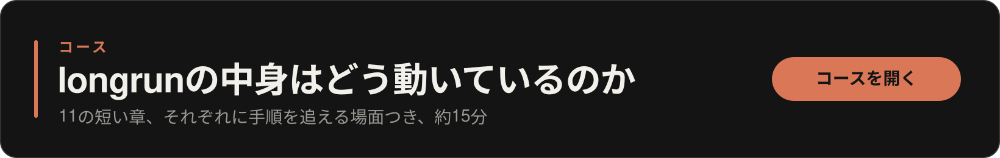
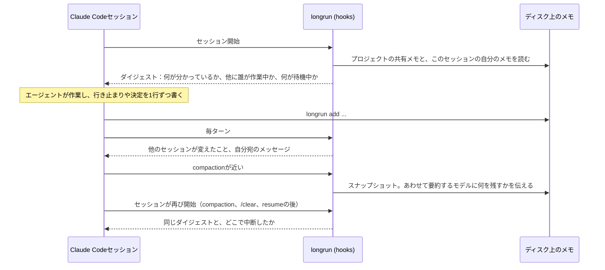

[English](README.md) | [Русский](README.ru.md) | [简体中文](README.zh-CN.md) | 日本語 | [한국어](README.ko.md)

<p align="center">
  
</p>

<h1 align="center">longrun</h1>

<p align="center">
  Claude Codeセッションのための記憶と協調。<br>
  プロジェクトの状態はディスクに残り、書いて整えるのはエージェント自身。<br>
  どのセッションも、プロジェクトが何を知っていて、ほかに誰が作業しているかを見る。<br>
  仕事はコンテキストを持っているセッションへ。待機は確実で、コストはゼロ。<br>
  1つのセッションがほかをまとめ、人間にしか決められないときは人間に届く。
</p>

<p align="center">
  <a href="#クイックスタート">クイックスタート</a> ·
  <a href="#セッションが協調する4つの方法">4つの協調方法</a> ·
  <a href="#仕組み">仕組み</a> ·
  <a href="#コマンド">コマンド</a> ·
  <a href="docs/REFERENCE.md">リファレンス</a> ·
  <a href="https://krllx.github.io/longrun/course/ja/">コース</a>
</p>

<p align="center">
  
  
  
  
  
  
</p>

<p align="center">
  <a href="https://krllx.github.io/longrun/course/ja/"></a>
</p>

---

> 英語版がソースであり、このページより新しい場合があります。修正の指摘は歓迎です。[docs/TRANSLATION.md](docs/TRANSLATION.md)をご覧ください。

## クイックスタート

```bash
curl -fsSL https://krllx.github.io/longrun/install.sh | bash
```

> [!NOTE]
> インストーラーが入れるのは、ターミナル用の`longrun`コマンド付きのskill、`~/.claude/settings.json`のhook、そしてバックグラウンドで5分ごとに動くタイマーです。デスクトップ通知を設定するかどうかを尋ねます。`install.sh --uninstall`ですべて元に戻せます。

<details>
<summary>このマシンで実際に何が変わるか</summary>

- `~/.claude/settings.json`：11個のhookエントリと、エージェントが`longrun`を呼べるようにする2つの権限ルール。インストーラーは先にこのファイルを`~/.claude/backups/`へコピーし、longrun以外のhookには手を触れません。
- `~/.claude/skills/longrun/`と、シンボリックリンク`~/.local/bin/longrun`。
- ユーザースコープのMCPサーバー`longrun`(`claude mcp add`)。`ask`と`notify`のツールはこのサーバーが提供します。
- **バックグラウンドのタイマー**、5分ごと：macOSではlaunchd agent、Linuxではsystemd user timerかcrontabの1行。登録したウォッチを確認し、セッションの様子を見ます。数回のシェルチェックだけで、モデルもtokenも使わず、登録した条件のどれかが成立したときだけセッションを起こします。`--no-timer`で外せます。
- **デスクトップ通知**、インストーラーの質問に「はい」と答えた場合：macOSでは`terminal-notifier`がなければ`brew install terminal-notifier`、そしてmacOSの権限ダイアログを出すためのテスト通知が1つ。Linuxでは`notify-send`があるかを確認するだけです。`--notify`と`--no-notify`は、この質問にあらかじめ答えておくためのものです。

macOSまたはLinux、Claude Code、python3 3.9以上が必要です。cloneからインストールする場合も同じ[`install.sh`](install.sh)です。

</details>

あとはClaude Codeでプロジェクトを開き（すでに開いているものでかまいません）、「**set up longrun**」と言うだけです。ターミナルからなら：

```bash
cd ~/my-project && longrun init && claude "set up longrun"
```

ここから先は、コマンドを打つ必要はありません。「*記録しておいて*」、「*これまで何を試したか*」、「*PRがマージされたら教えて*」と言うだけです。

> **中身の仕組みを例つきで**：[コース](https://krllx.github.io/longrun/course/ja/)、11の短い章、約15分。

<details>
<summary><b>デスクトップ通知</b>：何のためにあり、インストーラーは何を尋ねるのか</summary>

- **なぜ**：全停止、発火したウォッチ、ターンの終了は、通知がなくてもセッションに届きます。バナーは、別のウィンドウを見ている*人間*が気づくための手段です。longrunが通知に依存することはありません。
- **macOS**：Homebrew経由の`terminal-notifier`（OS標準の手段ではバナーが表示されません）と、権限の確認が1回。インストール時に断った場合は、あとから`brew install terminal-notifier`で入れられます。
- **Linux**：`notify-send`(`libnotify`)。たいていのデスクトップ環境にはすでに入っています。

`longrun notify --test`は、通知が実際に画面へ届くかを確かめます。見ておく価値のある設定が2つあります。`notify_turn_end unfocused`（Claudeのウィンドウが前面にないときにセッションがターンを終えるとバナーを出す）と、絶対に見逃したくない1つのセッションのための`longrun important on|next`です。エージェントが呼ぶ`notify`ツールは、インストーラーが登録する`longrun` MCPサーバーが提供します。macOS特有の癖も含めた全体像は[docs/REFERENCE.md](docs/REFERENCE.md)にあります。

</details>

## ひとことで

**何も言わなくても、最初のセッションから**：プロジェクトはディスク上にメモの束を持ちます。行き止まり・決定・事実を、エージェント自身が書き、読み直し、整理します。どのセッションも、そこに何が書かれていて、ほかにどんなセッションがあり、それぞれが最後に何をしたかを知った状態で始まり、毎ターン、その後ほかのセッションが何を変えたかが表示されます。

**頼んだとき、またはエージェントが必要だと判断したとき**：仕事はすでにコンテキストを持っているセッションへ渡されます。「PRがマージされたら教えて」は、待つ間tokenを使わず取りこぼしもないウォッチになります。見逃したくないセッションについては通知が人間に届きます。1つのセッションがほかのセッションを決めた目標へ向けてまとめ、人間にしか解けない詰まりがあれば目の前にダイアログを出します。

**そして副産物として**：ディスク上のメモは劣化しないので、hookがcompaction（会話履歴が自動で要約されること）、`/clear`、resumeのたびにそれをコンテキストへ戻します。この点の重みは以前より小さくなりました。同じhookが要約するモデルにも何を残すかを伝えるようになり、普通のcompactionでも失われるものが減ったからです。

## なぜ

| longrunがない場合 | longrunがある場合 |
|---|---|
| セッションが突き止めたことは、すべてその会話の中だけに残ります。次のセッション、つまり明日のセッションや隣のウィンドウのセッションは、何も知らないところから始まり、いま何が起きているのかを人間に尋ねます。 | **覚えているプロジェクト**。プロジェクトごとに1つの`.longrun/`。中のメモを書き、読み直し、整理するのはエージェント自身です。どのセッションもそのメモから始まり、ほかに誰が作業していて、それぞれが最後に何をしたかも分かります。 |
| 2つ目のセッションは1つ目の存在を知りません。片方がPRを作ったのに、もう片方は「PRはまだ作られていない」と言います。 | **メッセージとタスク**。仕事はすでにコンテキストを持っているセッションへ渡り、相手にはユーザーのターンとして届きます。止まっているセッションにも渡せます。そのメッセージはプロジェクトの受信箱で待ちます。 |
| 「PRがマージされたら教えて」は、tokenを浪費するポーリングループか、決めた時間だけ待つsleepになります。sleepが明けたころには、イベントはとうに過ぎているか、まだ来ていません。 | **ウォッチ**。バックグラウンドのタイマーが5分ごとにモデルなしで条件を確かめ、成立したらセッションを起こします。確実で、反応が速く、コストはゼロです。 |
| 1つのプロジェクトに5つのセッション。何が終わり、何が詰まり、次が何かを知っているのは人間だけで、そのうちの1つが自分の返事を待っていることに気づけるのも人間だけです。 | **オーケストレーター**。1つのセッションがほかのセッションのためにボードを持ち、停滞しているセッションを見つけ、人間にしか決められないときは全ウィンドウの手前にダイアログを出します。 |
| compactionは履歴を要約に圧縮します。真っ先に消えるのは理由です。どのアプローチをなぜ捨て、なぜこの道を選んだのか。 | **ディスク上のメモは劣化しません**。hookはcompactionの後にそれをコンテキストへ戻します。あわせて要約するモデルにも何を残すかを伝えるので、compaction自体で失われるものも減ります。 |

pythonファイル1つ、依存なし。

## Claude Codeにすでにあるもの

longrunが受け持つのは、1つのターンや1つのセッションより長く残るものです。まずは組み込みの仕組みを見てください。

- **1つのセッションを、確かめられる1つの条件へ向けて動かす** -> `/goal`。条件が成立したことを別の評価役が確認するまで、そのセッションを進め続けます。longrunにあるのはボードと説得であって、評価役ではありません。
- **1つのターンの中で作業を分ける** -> subagentとworkflow。並行して動き、合流し、ターンが終われば消えます。
- **タスクそのものより長く残るもの**（ユーザーが誰か、どう仕事を進めるか、いつもの約束事）-> Claude Codeの自動メモリ。
- **いま動いているセッションへのメッセージ** -> 組み込みの`SendMessage`。動いているセッションの一覧は`ListAgents`が出します。
- **複数のウィンドウで、何時間も何日も** -> longrun。どのターンよりも長く残る状態、止まっていても書き込めるセッション、tokenを使わない待機、そしてほかをまとめる1つのセッション。

## セッションが協調する4つの方法

> [!NOTE]
> 以下のコマンドは、エージェントが自分で実行するものです。いつメモを書き、いつメッセージを送り、いつウォッチを仕掛けるかはskillが指示します。ここに覚えるべきコマンドは1つもありません。「*記録しておいて*」や「*PRがマージされたら教えて*」と言うだけ、あるいは何も言わなくてかまいません。並べてあるのは、手で実行したくなったときのためです。

### 1. ディスク上の共有ドキュメント

プロジェクトごとに1つの`.longrun/`が、全セッションから見えるメモを持ちます。メモは何も指定しなければここへ入ります。自分のところだけに留めたいときは`--own`で、リポジトリのツリーの外に置かれます。hookはcompaction、`/clear`、resumeのたびに両方を戻し、毎ターン他のセッションが何を変えたかを表示します。

```bash
longrun add -t pin "PR 42 = branch feature/checkout"           # shared: every session sees it
longrun add --own -t ctx "only the checkout drawer, not the cart"  # this conversation only
longrun doc add research/plan.md "the rollout plan and what is open"
longrun recall 429                                             # notes, those files, journals, transcripts
```

### 2. コンテキストを持っているセッションへの委譲

他のセッションへのメッセージは、相手のセッションにはユーザーのターンとして届きます。動いているセッションはsocket経由ですぐに受け取ります。止まっているセッションは、次のターンでプロジェクトの受信箱から受け取ります。`--resume`を付けたときだけその場で起きますが、バックグラウンドで`claude -p`を実行するためtokenを使います。セッションの名前は、サイドバーに表示されているタイトルです。

この前半はClaude Code自身にもあります。`SendMessage`は**動いている**セッションへ書き込み、`ListAgents`は動いているセッションを一覧にします。`longrun send`が足すのは残りの部分です。止まっているセッションへ送れること（メッセージは受信箱で待ちます）、session idではなくサイドバーのタイトルで宛先を指定できること、`--resume`でheadlessに起こせること、そして発火したウォッチとボードが通るのと同じ経路であることです。ウォッチもボードも、代わりにツールを呼んでくれるモデルを持っていません。

```bash
longrun send "PR 43: payments" "PR 42 merged, rebase onto main"
longrun board assign T8 "PR 43: payments"      # a task instead of a message
```

### 3. イベント駆動：tokenを使わずに待つ

ウォッチとは、タイマーが5分ごとにモデルなしで実行する決定論的なチェックです（macOSではlaunchd agent、Linuxではsystemd user timerかcronジョブ）。条件が成立すると、セッションは`--then`で指定した文面をメッセージとして受け取ります。ノートPCがスリープしていても、チェックが遅れるだけです。

```bash
longrun watch add --to "PR 43: payments" --then "rebase onto main" -- pr-merged 42
longrun watch add --then "check the deploy" -- at 10:00
```

チェックの種類：`pr-merged`（`gh`経由のGitHub）、`pr-status`、`at`、`file`、`http`、`cmd`。

### 4. 1つのセッションが他をまとめ、必要なときは人間に届く

1つのセッションがオーケストレーターの役を引き受け、ボードを持ちます。ボードに載るのは目標、タスク、外から来た事実です。作業役のセッションはタスクを取り、終わらせ、詰まったタスクにはブロックの印を付けます。ボードが変わるたびにオーケストレーターが目を覚まし、次のタスクを配り、詰まりを解消し、あるいは全ウィンドウの手前に出るダイアログで人間に尋ねます。ポーリングはせず、セッションを自分で立ち上げることもしません。デスクトップアプリではクリックすればセッションが開くチップ（ボタン）を残し、ターミナルでは、自分で貼り付けるための最初の1行を渡します。

これは複数のウィンドウをまたぐ協調と、人間への連絡線であって、自律ではありません。**1つ**のセッションを、評価役が確かめられる条件へ向けて動かすのは`/goal`の役目です。

```bash
longrun orchestrate start --goal "ship the checkout drawer"    # in the coordinating session
longrun board take T7; longrun board done T7 "PR 42 merged"    # in a worker
longrun board add --fact "reviewer wants the field renamed"    # something learned outside
longrun ask "Merge PR 42?" --options "Yes,No"                  # a dialog, answered inline
```

主導権は人間が握ったままです。オーケストレーターと監視役は提案するだけで、できるのはセッションへメッセージを送ること、人間の前に質問を出すこと、そして`longrun halt`で全セッションを一度に止めることだけです。停止を解除できるのは人間だけです。動いているツールを殺すものは何もありません。詰まったウィンドウを止めるのは人間の役目で、Escで止めます。

## 仕組み



**開始**。hookはディレクトリからプロジェクトを見つけ、ダイジェストを出力します。中身は共有メモ、自分のメモ、他のセッション（動いているかどうか、それぞれの最後の作業）、待機中のウォッチ、未配送のメッセージです。

**作業**。エージェントは行き止まり・決定・苦労して得た事実を1行ずつ書きます。hookは編集回数を数え、失敗したコマンドを記録します。メモなしの編集が長く続くと、メモを書くよう1度だけ促します。

**毎ターン**。受信箱のメッセージが配送されます。他のセッションが共有メモに加えた変更は差分として現れます。`+`が追加、`~`が書き換え、`-`が削除です。

**compaction**。その前に、直近のリクエスト、編集したファイル、最近の失敗のスナップショットを取り、あわせて要約するモデルへの指示も渡します。行き止まりは理由ごと残す、正確な文字列は残す、ファイルを1回読めば取り戻せるものは捨てる、という指示です。Claude Codeは自動のcompactionでも`/compact <text>`と同じ要約promptを組み立てるので、longrunは同じ指示を、タイミングを見計らう手間なしに代わりに渡しているだけです。compactionの後、要約はそのままアーカイブされます。次の開始ではダイジェストに加えてHANDOFFブロックが出力され、セッションは同じ場所から続きます。resumeと`/clear`は同じメモを引き継ぎ、forkはコピーを受け取ります。

**片付け**。1時間に1度：古いエントリはアーカイブへ（`pin`は除く）、ジャーナルは切り詰め、動きのないセッションはアーカイブへ。メモの容量が上限に達したとき`add`は拒否し、何を削ればよいかを示します。黙って捨てることはありません。

## 3つの実体

| 実体 | 説明 | 何を保存するか |
|---|---|---|
| **プロジェクト** | `.longrun/`ディレクトリ1つ。プロジェクトのフォルダの中か、ツリーの外(`--external`) | 共有メモ、受信箱、ボード、アーカイブ |
| **セッション** | Claude Codeの会話1つ。アプリではサイドバーの1行。resumeでは新しいidになり、longrunが古いidと新しいidを繋ぎます | 自分のメモ、ジャーナル、カウンター、最後の状態 |
| **ディレクトリ** | セッションが始まったフォルダ。リポジトリのルート、worktree、サブディレクトリ | 何も保存しません。そのセッションがどのプロジェクトに属するかを示すだけです |

worktreeは`longrun link <project>`で紐づけます。worktree自体はメモの保存先を持ちません。

## 何を書くか

判断基準は1つ。**コマンド1回、ファイルの読み取り1回、grep1回で取り戻せるか**？取り戻せるなら書きません。1行に収まらないほど長いものは、メモではなくファイルにします。メモにはそのファイルを指し示す1行だけを置きます：`longrun doc add research/plan.md "the rollout plan and what is still open"`。どのセッションも開始のたびにこの1行を目にし、必要になったときだけファイルを開きます。

| タグ | 何を | どこへ |
|---|---|---|
| `dead` | 失敗したアプローチと、その理由 | 自分のメモ。他のセッションも同じ行き止まりに突き当たりそうなら共有 |
| `decision` | 選択と、その理由 | 他のセッションに関わるなら共有 |
| `fact` | 手間をかけて分かった環境の事実 | 共有 |
| `pin` | 有効期限のない事実。PR番号、ブランチ、ホスト | 共有 |
| `ctx` | 人間から与えられたタスクの前提 | 自分のメモ |
| `doc` | 1行に収まらないファイルを指し示す1行：`longrun doc add <path> "what is in it"` | 共有 |

事実でなくなったメモを、みんなに黙って消すことはしません。`longrun stale n12 "staging moved to vla-07"`が古くなった印をつけると、その印は全セッションから見え、次の片付けは印のついたエントリから先に処理します。`longrun mute n12`はまったく別の機能で、*自分の*ダイジェストからその行を外すだけです。ほかの誰にとっても何も変わりません。

機械的な記録はジャーナルが勝手に残します。何を編集し、何が失敗し、いつcompactionが起きたか。ですから進捗の実況は書き留めるようなものではありません。タスクより長く残るもの（ユーザーが誰か、どう仕事を進めるか）は、longrunではなくClaude Codeの自動メモリへ入れます。

## コマンド

```bash
longrun init [--external] | link <project> | where | onboard | config
longrun add [--own] -t TAG "..." | rm | replace | stale | mute | notes | prune | recall <term>
longrun doc add <path> "what is in it" | doc ls | doc touch n12 "..." 
longrun status | send [--list] [--resume] WHO "..."
longrun watch add --to WHO --then "..." -- pr-merged 42 | at 10:00 | cmd '...' | file /path | http URL
longrun orchestrate start --goal "..." | board [add --fact|ack] | ask | halt | resume
```

全フラグ、ファイル形式、Claude Codeについて検証した事実は[docs/REFERENCE.md](docs/REFERENCE.md)。オーケストレーターの設計と残っている課題は[docs/ORCHESTRATOR.md](docs/ORCHESTRATOR.md)。

<!-- site: nuances, limits and edge cases move to the site; add the link here -->

<details>
<summary><b>よくある質問</b></summary>

**PRはあるのに、エージェントが「PRはまだ作られていない」と言う**。その事実が共有メモにありません：`longrun add -t pin "PR 42 = branch feature/checkout"`。

**worktreeのセッションがプロジェクトのメモを見られない**。`longrun where`にプロジェクトが出る必要があります。"not initialised"と出たら、そのworktreeで`longrun link <project>`を実行します。

**メッセージを送ったのにセッションが黙ったまま**。`longrun send --list`で確かめます。宛先が"stopped"ならメッセージは受信箱にあり、次のターンで受け取ります。今すぐ届けたいときは`--resume`です。

**ウォッチが一向に発火しない**。`longrun watch status`、`longrun watch ls --all`、`longrun watch test -- <the same check>`で確かめます。よくある原因は、`cmd`の中の相対パスかシェルのaliasです。
</details>

## 開発

```bash
bash tests/run.sh            # 211 regression checks, no API calls
bash tests/scenarios.sh      # 37 scenarios, one per goal
bash tests/orchestrator.sh   # 51: the orchestrator layer
bash tests/ask.sh            # 27: the dialog and the MCP server
```

インストーラーはファイルを`~/.claude/skills/longrun/`にコピーします。checkoutから読み込まれるものはありません。hookはイベントごとに別プロセスなので、動いているセッションも再起動なしで更新を拾います。

## ライセンス

[MIT](LICENSE)
