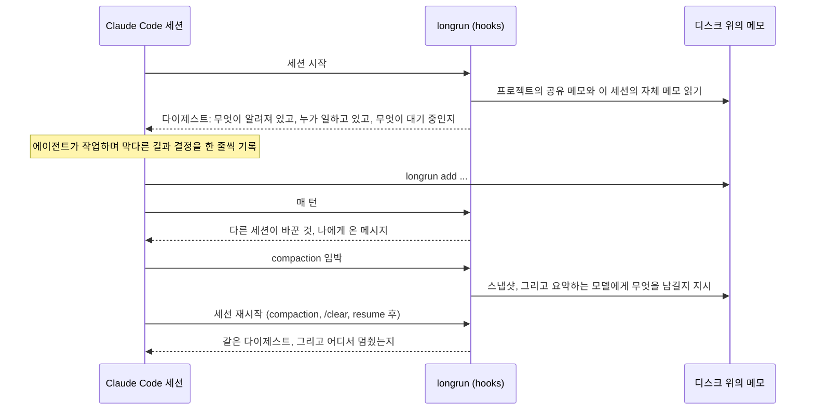

[English](README.md) | [Русский](README.ru.md) | [简体中文](README.zh-CN.md) | [日本語](README.ja.md) | 한국어

<p align="center">
  
</p>

<h1 align="center">longrun</h1>

<p align="center">
  Claude Code 세션을 위한 기억과 협력.<br>
  compaction(대화 기록이 자동으로 요약되는 동작) 후에도 사라지지 않는 메모. 서로 메시지를 보내고 작업을 넘기는 세션.<br>
  놓치는 일 없는 대기: 폴링 루프 없이, 이벤트가 발생하면 세션이 깨어납니다.<br>
  나머지 세션을 정해진 목표까지 이끄는 한 세션.
</p>

<p align="center">
  <a href="#빠른-시작">빠른 시작</a> ·
  <a href="#세션이-협력하는-네-가지-방법">네 가지 협력 방법</a> ·
  <a href="#동작-방식">동작 방식</a> ·
  <a href="#명령어">명령어</a> ·
  <a href="docs/REFERENCE.md">레퍼런스</a> ·
  <a href="https://krllx.github.io/longrun/course/">강의</a>
</p>

<p align="center">
  
  
  
  
  
  
</p>

<p align="center">
  <a href="https://krllx.github.io/longrun/course/"></a>
</p>

---

> 영어판이 원본이며, 이 페이지보다 최신일 수 있습니다. 수정 제안은 언제든 환영합니다. [docs/TRANSLATION.md](docs/TRANSLATION.md)를 참고하십시오.

## 빠른 시작

```bash
curl -fsSL https://raw.githubusercontent.com/krllx/longrun/main/install.sh | bash
```

> [!NOTE]
> 설치 스크립트는 터미널용 `longrun` 명령이 포함된 skill, `~/.claude/settings.json`의 hook, 그리고 백그라운드에서 5분마다 실행되는 타이머를 설치합니다. 데스크톱 알림은 설정할지 먼저 묻습니다. `install.sh --uninstall`로 전부 되돌립니다.

<details>
<summary>이 컴퓨터에서 실제로 바뀌는 것</summary>

- `~/.claude/settings.json` - hook 항목 11개와, 에이전트가 `longrun`을 호출하도록 허용하는 권한 규칙 2개. 파일은 먼저 `~/.claude/backups/`로 복사하고, longrun이 아닌 다른 hook은 건드리지 않습니다.
- `~/.claude/skills/longrun/` 디렉터리와 심볼릭 링크 `~/.local/bin/longrun`.
- 사용자 스코프의 MCP 서버 `longrun`(`claude mcp add`). `ask`와 `notify` 도구가 여기에서 나옵니다.
- **백그라운드 타이머**, 5분마다: macOS에서는 launchd agent, Linux에서는 systemd user timer나 cron 한 줄. 등록해 둔 워치를 확인하고 세션 상태를 살펴봅니다. 셸 검사 몇 번이 전부이므로 모델도 token도 쓰지 않으며, 걸어 둔 조건 중 하나가 성립했을 때만 세션을 깨웁니다. `--no-timer`로 건너뜁니다.
- **데스크톱 알림**, 설치 중 질문에 예라고 답했을 때: macOS에서는 `terminal-notifier`가 없으면 `brew install terminal-notifier`, `~/.claude/longrun/notifier/` 아래에 두는 알림 발신용 번들, 그리고 macOS가 권한 요청 창을 띄우도록 하는 테스트 알림 하나. Linux에서는 `notify-send`가 있는지만 확인합니다. `--notify`와 `--no-notify`는 이 질문에 미리 답해 두는 옵션입니다.

macOS 또는 Linux, Claude Code, python3 3.9 이상이 필요합니다. 리포지터리를 clone해서 설치할 때도 같은 [`install.sh`](install.sh)를 씁니다.

</details>

그다음 Claude Code에서 프로젝트를 열고(이미 열려 있어도 괜찮습니다) "**set up longrun**"이라고 말하면 됩니다. 터미널에서 한다면:

```bash
cd ~/my-project && longrun init && claude "set up longrun"
```

여기서부터는 따로 실행할 명령이 없습니다. "*기록해 둬*", "*지금까지 뭘 시도했지*", "*PR 머지되면 알려줘*"라고 말하면 됩니다.

> **내부가 어떻게 돌아가는지, 예제와 함께**: [강의](https://krllx.github.io/longrun/course/) - 짧은 장 11개, 약 15분(영어).

<details>
<summary><b>데스크톱 알림</b> - 무엇에 쓰는 것이고, 설치 스크립트는 무엇을 묻는지</summary>

- **왜 필요한가**: 전체 중단, 발동한 워치, 끝난 턴은 알림이 없어도 세션에 전달됩니다. 배너는 다른 창을 보고 있을 때 그 사실을 알아차리게 해 주는 수단입니다. longrun이 알림에 의존하는 일은 없습니다.
- **macOS**: Homebrew로 설치하는 `terminal-notifier`(OS 기본 기능으로는 배너가 뜨지 않습니다)와 권한 확인 한 번. 설치할 때 아니라고 답했다면 나중에 `longrun notify setup`으로 추가할 수 있습니다.
- **Linux**: `notify-send`(`libnotify`). 대부분의 데스크톱 환경에는 이미 들어 있습니다.

`longrun notify --test`는 알림이 실제로 화면까지 도달하는지 확인합니다. 눈여겨볼 설정이 두 가지 있습니다. `notify_turn_end unfocused`(Claude 창이 앞에 없을 때 세션이 턴을 마치면 배너를 띄웁니다)와, 절대 놓치면 안 되는 세션 하나를 지정하는 `longrun important on|next`입니다. 에이전트가 호출하는 `notify` 도구는 설치 스크립트가 등록하는 `longrun` MCP 서버에서 옵니다. macOS 특유의 까다로운 부분까지 포함한 자세한 설명은 [docs/REFERENCE.md](docs/REFERENCE.md)에 있습니다.

</details>

## 한마디로

**아무것도 하지 않아도, 첫 세션부터**: 에이전트는 막다른 길, 결정, 사실을 메모로 디스크에 적습니다. hook은 compaction, `/clear`, resume 때마다 그 메모를 다시 불러오고, 요약하는 모델에게는 무엇을 남길지 알려 주며, 매 턴 프로젝트의 다른 세션이 무엇을 바꿨는지 보여 줍니다.

**요청했을 때, 또는 에이전트가 필요하다고 판단했을 때**: "PR 머지되면 알려줘"(기다리는 동안 token을 쓰지 않는 워치), 세션 사이의 메시지와 작업, 신경 쓰는 세션이 턴을 마쳤을 때의 알림, 한 세션이 나머지를 정해진 목표까지 이끄는 방식.

## 왜 필요한가

| longrun이 없을 때 | longrun이 있을 때 |
|---|---|
| compaction은 대화 기록을 요약으로 압축하는데, 왜 그렇게 했는지가 가장 먼저 사라집니다. 30분 뒤 에이전트는 자기가 이미 되돌린 수정을 다시 제안합니다. | **디스크 위의 메모**. 막다른 길, 결정, 사실을 한 줄씩. 공유 메모는 모든 세션이 보고, 자체 메모는 compaction, `/clear`, resume 때마다 돌아옵니다. |
| 두 번째 세션은 첫 번째 세션이 있다는 것조차 모릅니다. 한쪽은 PR을 만들었는데 다른 쪽은 "PR은 아직 만들어지지 않았다"고 말합니다. | **메시지와 작업**. 세션이 메시지를 보내거나 작업을 넘기면 상대 세션에 사용자 턴으로 도착합니다. |
| "PR 머지되면 알려줘"는 token을 소모하는 폴링 루프가 되거나, 제때 깨어나지 못하는 sleep이 됩니다. | **워치**. 백그라운드 타이머가 5분마다 모델 없이 조건을 확인하고, 성립하면 세션을 깨웁니다. 확실하고, 반응이 빠르고, 비용이 들지 않습니다. |
| 프로젝트 하나에 세션이 다섯 개. 무엇이 끝났고 무엇이 막혔고 다음이 무엇인지는 사람만 압니다. | **오케스트레이터**. 한 세션이 보드를 맡아 작업을 나눠 주고, 정체된 세션을 알아채고, 꼭 필요할 때만 대화 상자로 사람에게 묻습니다. |

python 파일 하나, 의존성 없음.

## 세션이 협력하는 네 가지 방법

> [!NOTE]
> 아래 명령은 에이전트가 스스로 실행합니다. 언제 메모를 쓰고, 언제 메시지를 보내고, 언제 워치를 걸지는 skill이 알려 줍니다. 여기에 외워야 할 명령은 하나도 없습니다. "*기록해 둬*"나 "*PR 머지되면 알려줘*"라고 말하면 되고, 아무 말도 하지 않아도 됩니다. 그래도 여기에 적어 둔 이유는, 손으로 실행하고 싶을 때 언제든 그렇게 할 수 있기 때문입니다.

### 1. 디스크 위의 공유 문서

프로젝트마다 하나씩 있는 `.longrun/` 디렉터리에 모든 세션이 보는 메모가 들어 있습니다. 각 세션은 자체 메모를 리포지터리 트리 바깥에 따로 둡니다. hook은 compaction, `/clear`, resume 때마다 둘 다 되살리고, 매 턴 다른 세션이 무엇을 바꿨는지 보여 줍니다.

```bash
longrun add --shared -t pin "PR 42 = branch feature/checkout"     # for every session
longrun add -t dead "retry on 429 does not help, limit is per org"  # for this one
longrun recall 429                                                  # search everything
```

### 2. 컨텍스트가 있는 세션에 위임

다른 세션으로 보낸 메시지는 그쪽에서 사용자 턴으로 도착합니다. 돌아가고 있는 세션은 socket으로 바로 받고, 멈춰 있는 세션은 다음 턴에 프로젝트 수신함에서 받습니다. `--resume`을 붙였을 때만 그 자리에서 깨어나는데, 이 경우 백그라운드에서 `claude -p`가 실행되므로 token을 씁니다. 세션 이름은 사이드바에 보이는 제목 그대로입니다.

```bash
longrun send "PR 43: payments" "PR 42 merged, rebase onto main"
longrun board assign T8 "PR 43: payments"      # a task instead of a message
```

### 3. 반응성: token을 쓰지 않는 대기

워치는 정해진 규칙대로만 판정하는 검사로, 타이머(macOS에서는 launchd agent, Linux에서는 systemd user timer나 cron 작업)가 5분마다 모델 없이 실행합니다. 조건이 성립하면 세션은 `--then`에 적은 문구를 메시지로 받습니다. 노트북이 잠들어 있으면 검사가 미뤄질 뿐입니다.

```bash
longrun watch add --to "PR 43: payments" --then "rebase onto main" -- pr-merged 42
longrun watch add --then "check the deploy" -- at 10:00
```

검사 종류: `pr-merged`(`gh`로 GitHub 확인), `pr-status`, `at`, `file`, `http`, `cmd`.

### 4. 선택적 자율성: 한 세션이 나머지를 이끄는 방식

한 세션이 오케스트레이터 역할을 맡아 보드를 유지합니다. 보드에는 목표, 작업, 바깥에서 들어온 사실이 담깁니다. 작업 세션은 작업을 가져가서 끝내고, 막히면 알립니다. 그때마다 오케스트레이터가 깨어나 다음 작업을 나눠 주고, 막힌 것을 풀거나, 모든 창 앞에 뜨는 대화 상자로 사람에게 묻습니다. 폴링도 하지 않고, 세션을 직접 띄우지도 않습니다. 데스크톱 앱에서는 클릭하면 세션이 열리는 칩(버튼)을 남기고, 터미널에서는 직접 붙여 넣을 첫 줄을 건네줍니다.

```bash
longrun orchestrate start --goal "ship the checkout drawer"    # in the driving session
longrun board take T7; longrun board done T7 "PR 42 merged"    # in a worker
longrun ask "Merge PR 42?" --options "Yes,No"                  # a dialog, answered inline
```

제어권은 사람이 계속 쥐고 있습니다. 정체된 프로세스를 죽이고(`longrun interrupt`), 모든 세션을 멈추고(`longrun halt`), 그 정지를 다시 푸는 것까지 전부 사람 몫입니다. 감시자와 오케스트레이터는 제안만 합니다. 기본으로 꺼져 있어 직접 켜야 동작하는 기능도 있습니다. 5시간 사용량 예산(`longrun budget on`)은 사용량이 계획보다 빨리 늘면 모든 세션을 멈추고 어떻게 할지 묻습니다.

## 동작 방식



**시작**. hook은 디렉터리로 프로젝트를 찾아 다이제스트를 출력합니다. 다이제스트에는 공유 메모, 자체 메모, 다른 세션(살아 있는지, 각자 마지막으로 무엇을 했는지), 대기 중인 워치, 아직 전달되지 않은 메시지가 들어 있습니다.

**작업**. 에이전트는 막다른 길, 결정, 어렵게 얻은 사실을 한 줄씩 적습니다. hook은 편집 횟수를 세고 실패한 명령을 기록합니다. 메모 없이 편집만 길게 이어지면 에이전트에게 메모를 남기라고 한 번 알려 줍니다.

**매 턴**. 수신함의 메시지가 전달됩니다. 다른 세션이 공유 메모를 바꾼 내용은 변경분으로 표시됩니다. `+`는 추가, `~`는 수정, `-`는 삭제입니다.

**compaction**. compaction 직전에 최근 요청, 편집한 파일, 최근 실패의 스냅샷을 남기고, 요약하는 모델에게 줄 지시도 함께 넘깁니다. 막다른 길은 이유까지 남기고, 정확한 문자열은 남기고, Read 한 번이면 되찾을 수 있는 것은 버리라는 내용입니다. Claude Code는 자동 compaction에서도 `/compact <text>`와 똑같은 요약 prompt를 만듭니다. 그래서 longrun은 같은 방식으로 요약을 유도하며, 사용자가 시점을 맞추는 수고만 덜어 줍니다. compaction이 끝나면 요약은 그대로 아카이브됩니다. 다음 시작 때는 다이제스트에 더해 HANDOFF 블록이 출력되어, 세션은 같은 자리에서 이어집니다. resume과 `/clear`는 같은 메모를 그대로 이어받고, fork는 사본을 받습니다.

**정리**. 한 시간에 한 번, 오래된 항목은 아카이브로 보내고(`pin`은 제외), 저널은 잘라 내고, 조용해진 세션도 아카이브로 보냅니다. 메모 한도에 이르면 `add` 명령은 저장을 거부하고 무엇을 덜어 내면 되는지 알려 줍니다. 소리 없이 버려지는 것은 없습니다.

## 세 가지 구성 요소

| 구성 요소 | 무엇인지 | 저장하는 것 |
|---|---|---|
| **프로젝트** | `.longrun/` 디렉터리 하나. 프로젝트 폴더 안에 두거나 트리 바깥에 둡니다(`--external`) | 공유 메모, 수신함, 보드, 아카이브 |
| **세션** | Claude Code 대화 하나. 앱에서는 사이드바의 한 줄. resume하면 id가 새로 생기고, longrun이 옛 id와 새 id를 이어 줍니다 | 자체 메모, 저널, 카운터, 마지막 상태 |
| **디렉터리** | 세션이 시작된 폴더. 리포지터리 루트, worktree, 하위 디렉터리 | 아무것도 저장하지 않습니다. 그 세션이 어느 프로젝트에 속하는지만 알려 줍니다 |

worktree는 `longrun link <project>`로 프로젝트에 붙이며, worktree 자체의 메모는 따로 없습니다.

## 무엇을 기록하는가

기준은 하나입니다. **명령 한 번, Read 한 번, grep 한 번으로 되찾을 수 있는가**? 그렇다면 적지 않습니다.

| 태그 | 무엇을 | 어디에 |
|---|---|---|
| `dead` | 실패한 접근과 그 이유 | 자체 메모. 다른 세션도 같은 함정에 빠질 수 있으면 공유 |
| `decision` | 선택과 그 이유 | 다른 세션과 관계있으면 공유 |
| `fact` | 어렵게 알아낸 환경 정보 | 공유 |
| `pin` | 만료가 없는 사실. PR 번호, 브랜치, 호스트 | 공유 |
| `ctx` | 사람이 준 작업의 배경과 조건 | 자체 메모 |
| `todo` | 에이전트가 하기로 한 짧은 후속 작업 | 자체 메모 |

마일스톤(push 완료, PR 생성, 테스트 통과)은 저널에 적습니다: `longrun log "PR opened"`. 작업보다 오래 남는 것(사용자가 누구인지, 어떻게 일하는지)은 longrun이 아니라 Claude Code의 자동 메모리에 넣습니다.

## 명령어

```bash
longrun init [--external] | link <project> | where | onboard | config
longrun add [--shared] -t TAG "..." | rm | replace | notes | prune | log "..." | recall <term>
longrun status | send [--list] [--resume] WHO "..."
longrun watch add --to WHO --then "..." -- pr-merged 42 | at 10:00 | cmd '...' | file /path | http URL
longrun orchestrate start --goal "..." | board | fact | ask | halt | resume | interrupt | budget
```

전체 플래그, 파일 형식, 검증된 사실은 [docs/REFERENCE.md](docs/REFERENCE.md)에 있습니다. 오케스트레이터의 설계와 남은 과제는 [docs/ORCHESTRATOR.md](docs/ORCHESTRATOR.md)에 있습니다.

<!-- site: nuances, limits and edge cases move to the site; add the link here -->

<details>
<summary><b>자주 묻는 질문</b></summary>

**PR이 있는데도 에이전트가 "PR은 아직 만들어지지 않았다"고 말합니다**. 그 사실이 공유 메모에 없기 때문입니다. 이렇게 적어 둡니다: `longrun add --shared -t pin "PR 42 = branch feature/checkout"`.

**worktree의 세션이 프로젝트 메모를 보지 못합니다**. `longrun where`의 출력에 프로젝트가 나와야 합니다. "not initialised"라고 나오면 그 worktree에서 `longrun link <project>`를 실행합니다.

**메시지를 보냈는데 세션이 조용합니다**. `longrun send --list`로 확인합니다. 받는 쪽이 "stopped"면 메시지는 수신함에 있고 다음 턴에 받습니다. 지금 당장 필요하면 `--resume`을 붙입니다.

**워치가 발동하지 않습니다**. `longrun watch status`, `longrun watch ls --all`, `longrun watch test -- <the same check>`. 흔한 원인은 `cmd` 안의 상대 경로나 셸 alias입니다.
</details>

## 개발

```bash
bash tests/run.sh            # 202 regression checks, no API calls
bash tests/scenarios.sh      # 30 scenarios, one per goal
bash tests/orchestrator.sh   # 67: the orchestrator layer
bash tests/ask.sh            # 30: the dialog and the MCP server
```

설치 스크립트는 파일을 `~/.claude/skills/longrun/`로 복사하며, checkout한 디렉터리에서 직접 읽어 들이는 것은 없습니다. hook은 이벤트마다 별도 프로세스로 실행되기 때문에, 돌아가고 있는 세션도 재시작 없이 업데이트를 받습니다.

## 라이선스

[MIT](LICENSE)
