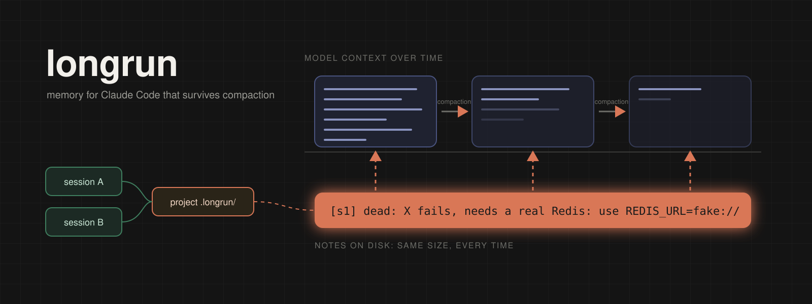
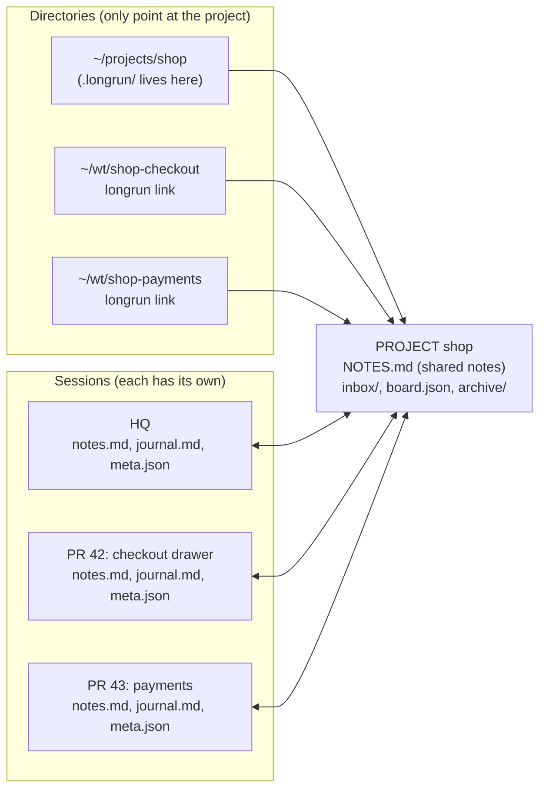

English | [Русский](README.ru.md)

<p align="center">
  
</p>

<h1 align="center">longrun</h1>

<p align="center">
  Shared project memory and per-session memory for Claude Code.<br>
  Notes that survive compaction, sessions that know about each other, waiting that costs no tokens.
</p>

<p align="center">
  <a href="#quick-start">Quick start</a> ·
  <a href="#how-it-works">How it works</a> ·
  <a href="#several-sessions">Several sessions</a> ·
  <a href="#the-orchestrator">Orchestrator</a> ·
  <a href="docs/REFERENCE.md">Reference</a> ·
  <a href="course/">Interactive course</a>
</p>

<p align="center">
  
  
  
  
  
</p>

---

## The problem

The model's context is finite, so on any long run compaction happens: the history is squeezed into a summary, and the next compaction squeezes the summary. Two things break first.

| | Disease | Cure |
|---|---|---|
| **1** | **Compaction loses the reasons.** The first thing the summary drops is "what we tried and why it failed". Half an hour later the agent proposes the fix it already reverted. | **A note on disk does not degrade.** The agent writes one line per dead end, decision or hard-won fact. Eleven hooks bring the notes back after every compaction, `/clear` and resume, and archive every compaction summary verbatim. |
| **2** | **Sessions do not know each other.** One session opened a PR, the other says "the PR is not created yet". A dead end walked by one is walked again by the other. | **One `.longrun/` per project.** Shared notes every session sees, a live list of who is doing what, messages between sessions delivered as user turns, and a launchd watcher that waits for events (PR merged, URL answers) with no model involved. |

Everything is one python script with no dependencies: the CLI, the hooks and the MCP server are the same file.

## Quick start

```bash
git clone https://github.com/<you>/longrun-skill && cd longrun-skill
./install.sh            # the skill, 11 hooks in ~/.claude/settings.json, the CLI ~/.local/bin/longrun, the MCP server
longrun watch install   # a launchd agent: deferred checks and the watcher every 5 minutes
cd ~/projects/shop && longrun init   # in the folder you open in Claude Code (add .longrun/ to your ignore file)
```

Then, in a Claude Code session: **"set up longrun"** (or `/longrun onboard`). The agent runs `longrun onboard`, explains the skill in a few sentences, asks about the main settings one at a time (the autocompact window, the 5-hour usage budget, stuck thresholds, note budgets) and applies the answers. One thing a hook cannot do is set the autocompact window, so it asks you to type `/autocompact 300k` yourself.

From there, nothing to call. At start the session gets a digest, after compaction everything comes back, changes made by other sessions arrive on the next turn. You can talk in words: *"write that down"*, *"what have we tried"*, *"session status"*, *"hand it to the other session"*, *"tell me when the PR merges"*.

> **Interactive course.** `python3 -m http.server 8765 --directory course` and open http://localhost:8765: eleven short parts with step-by-step scenarios showing what each command prints and what changes on disk. About 15 minutes.

## How it works

```mermaid
sequenceDiagram
    participant CC as Claude Code
    participant H as longrun hooks
    participant P as project (.longrun/)
    participant S as session (~/.claude/longrun/sessions)
    CC->>H: SessionStart
    H->>P: reads NOTES, inbox, board
    H->>S: reads notes, journal; writes meta
    H-->>CC: digest: SHARED + OWN + SESSIONS
    CC->>S: longrun add -t dead "..." (the agent)
    CC->>P: longrun add --shared -t pin "..." (the agent)
    CC->>H: UserPromptSubmit
    H-->>CC: what changed in SHARED since the last turn, messages
    CC->>H: PreCompact / PostCompact
    H->>P: snapshot and the summary into archive/
    CC->>H: SessionStart(compact)
    H-->>CC: digest + HANDOFF + journal tail
```

**Session start.** The `SessionStart` hook finds the project by directory (up the tree to `.longrun/`, else the registry), links the CLI id to the session key and prints the digest into the context: shared notes, own notes, the other sessions of the project (alive or not, what each did last), pending watches, undelivered messages.

**Work.** The agent writes one line, in English: `longrun add -t dead "..."` into its own notes, `longrun add --shared -t pin "PR 42 = branch feature/checkout"` into the shared ones, `longrun log "PR opened"` into the journal. `PostToolUse` counts edits, `PostToolUseFailure` writes the failed command into the journal. After 40 calls or 8 turns without a note, and only if there were edits or failures, one reminder.

**Every turn.** `UserPromptSubmit` delivers messages from the inbox and shows what other sessions changed in the shared notes since the last turn: `+` added, `~` rewritten, `-` removed.

**Compaction.** `PreCompact` snapshots the user's last substantive requests, the edited files and recent failures. `PostCompact` archives the compaction summary verbatim. The next `SessionStart` prints the digest again, plus the journal tail and a HANDOFF block from the snapshot, so the session continues from the same place.

**Resume, /clear, fork.** The desktop app resumes a session under a new CLI id; longrun follows the `priorCliSessionIds` chain and the own notes continue. `/clear` in the same folder continues the session that ended with reason `clear` a minute ago. A fork gets a copy of the parent's notes and lives on its own.

**Cleanup.** Once an hour: entries older than 14 days go to the archive (except `pin`), cheap `todo`/`ctx` entries are archived above 90% of a budget, journals are trimmed to 200 lines, sessions silent for a week are archived, archives older than 30 days are deleted. `add` refuses when a budget is full and names the cheapest entries to drop; nothing is evicted silently.

## Three entities, nothing else

| Entity | What it is | Defined by | Stores |
|---|---|---|---|
| **Project** | The shared memory of a group of sessions | One `.longrun/` directory, in the project folder or outside the tree (`--external`) | Shared notes, inbox, board, archive |
| **Session** | One Claude Code conversation; in the app, one row in the sidebar | The first CLI id of the chain; a resume gets a new id and longrun links them | Own notes, journal, counters and the last status |
| **Directory** | The folder where the session started: a repo root, a worktree, a subdirectory, a folder with several repos | Its path | Nothing. Only says which project the session belongs to |

"Project" means exactly the `.longrun/` directory: not a project in a monorepo and not Claude Code's transcripts folder. A worktree is attached with `longrun link <project>` and has no notes of its own.



## What to write, and where

One test: **would one command, Read or grep get this back?** If yes, do not write it.

| Tag | What | Where, usually |
|---|---|---|
| `dead` | an approach that failed, and why | own; shared if another session could walk into it |
| `decision` | a choice and its reason | shared if it concerns others |
| `fact` | a fact about the environment that cost effort | shared |
| `ctx` | task framing from the human | own |
| `pin` | a fact with no expiry: PR number, branch, host | shared |
| `todo` | a short follow-up the agent owes | own |

Milestones (pushed, PR opened, tests green) go to the journal through `longrun log`. What outlives the task (who the user is, how they work) goes to Claude Code's auto memory, not here. A lost detail: `longrun recall <term>` searches the shared and own notes of every session, the journals, every archived compaction summary and the project's transcripts.

## Several sessions

**A message to another session.** `longrun send "PR 43: payments" "PR 42 merged, rebase"`. A running recipient gets it through its socket as a user turn between tool calls. A stopped one gets a file in the project inbox, delivered by its hooks on its next start, turn or tool call; `--resume` wakes it through `claude -p --resume`. The recipient is named the way the human sees it: the sidebar title, a Claude Code name or an id prefix.

**Waiting for an event, with zero tokens.** `longrun watch add --to "PR 43: payments" --then "rebase onto main" -- pr-merged 42`. launchd runs the check every five minutes with no model involved; when the condition holds, the recipient gets the `--then` text the same way `send` delivers. A laptop asleep just delays the check. Checks: `pr-merged` (GitHub via `gh`, Arcadia via `arc`), `pr-status`, `at`, `file`, `http`, `cmd`.

## The orchestrator

One session takes the role (`longrun orchestrate start --goal "..."`) and keeps the board `.longrun/board.json`: the goal, tasks `T<n>` with statuses, facts `F<n>`. The other sessions learn three commands:

```bash
longrun board take T7                 # took the task
longrun board done T7 "PR 42 merged"  # closed it (wakes the orchestrator)
longrun board block T7 "which field name?"   # a question or a wall (wakes the orchestrator)
```

The orchestrator hands out work (`board assign`), sorts out facts (`fact ack`) and sees flags in the SESSIONS block without spending a token: ``tool `make test` 38m``, `turn 71m`, `waiting permission 12m`, `fail x3`, `ctx 262k/300k (87%)`. The watcher reports threshold breaches once per episode.

Its levers: `longrun halt "why"` refuses every tool call in every session (the `PreToolUse` hook answers deny with the reason, the model sees it), `longrun resume` lifts it; `longrun interrupt <session> --match <text>` lists a session's running Bash processes and `--yes` kills them. The rule: the watcher and the orchestrator only propose. Killing, halting and resuming happen on the human's word only.

**The 5-hour budget.** The watcher reads the usage window every five minutes and compares it with the plan (20% per hour, stop at 1.5x). A breach halts every project, reports to the orchestrator and shows a dialog. `longrun budget` shows it, `longrun budget off` turns it off.

**A question in front of every window.** `longrun ask "Merge PR 42?" --options "Yes,No"`, or the `ask` tool of the `longrun` MCP server. The answer comes back inline within 90 seconds, otherwise later as a turn. Cancel means "do not ask again, put it on the board".

Design notes and what is left: [docs/ORCHESTRATOR.md](docs/ORCHESTRATOR.md).

## Commands

```bash
longrun init [--external] [--hq]   # make this folder a project; --external keeps .longrun/ outside the tree
longrun link <project>             # from a worktree: sessions here belong to the project
longrun where                      # which project, which session, where the files are
longrun onboard [done]             # the first-conversation brief: what it does, nuances, this machine's state, settings to decide
longrun config [set KEY VALUE | unset KEY] [--global]   # effective settings and where each comes from
longrun add [--shared] -t TAG "..."   # a note: own (s-id) or shared (n-id)
longrun rm s3 n12 | replace s3 "..." | notes [--shared|--own] | prune [--auto] [--shared]
longrun log "milestone"            # one line in the session journal
longrun recall <term>              # search everything
longrun status                     # the project's sessions: name, alive, own notes, last answer
longrun send [--list] WHO "text"   # a message to a session
longrun watch add --to WHO --then "..." -- pr-merged 42 | at 10:00 | cmd '...' | file /path | http URL
longrun ask "question" --options "Yes,No"   # a dialog in front of every window
longrun board | fact | orchestrate | halt | resume | interrupt | budget   # the orchestrator layer
```

Full flags, formats and verified facts: [docs/REFERENCE.md](docs/REFERENCE.md).

<details>
<summary><b>Files on disk</b></summary>

```
<project>/.longrun/                       shared
  NOTES.md          shared notes [n1], [n2]...; 5000-byte budget; every entry has an author
  inbox/            messages for sessions, one file each; .archive/ holds the delivered ones
  board.json        the orchestrator's board; config.json settings; state.json id counters
  archive/          compact/ (compaction summaries, per session), precompact/ (snapshots),
                    notes.md (deleted shared entries), sessions/ (journals of dead sessions)

~/.claude/longrun/sessions/<project key>/<session key>/     own
  notes.md          own notes [s1], [s2]...; 3000-byte budget
  journal.md        milestones (`longrun log`) and mechanical lines: FAIL, compaction, start, end
  meta.json         turn and tool counters, cwd, last answer, the app's id, what was already shown

~/.claude/longrun/                                            global
  registry.json     directory -> project (worktrees and projects outside the tree)
  sessions/_index/  CLI id -> project and session key
  watch/            deferred checks, one file each; one launchd agent for every project
  config.json       global settings
```

Everything shared lives in the project. Everything own lives outside the repository tree and outside synced folders, because it is rewritten on every tool call.
</details>

<details>
<summary><b>What the mechanics guarantee, and what depends on the model</b></summary>

- Guaranteed by the hooks: the archive of every compaction summary, the journal of failures, the HANDOFF snapshot, notes returning into the context, message delivery, the shared-notes delta, tool refusal under halt, watch checks.
- Depends on the model following SKILL.md: that a note is written and written to the point, that `recall` runs before re-exploring, that a message from a peer is not taken for the human's word.
- The digest is at most 9000 bytes (Claude Code caps hook output at 10,000). Evicted in order: the session list, watches, the journal tail, HANDOFF. Notes are never evicted, hence the 5000 + 3000 budgets.
- The session socket and transcript formats are undocumented: on a Claude Code version change, `send` into a running session breaks first; the inbox queue keeps working.
- Under launchd, python may have no access to `~/Documents` (macOS TCC). Checks do not depend on it; a message is then placed into the session directory under `~/.claude`.
- Subagents do not get the digest. `/rewind` does not roll notes back. Windows is untested; the watcher is launchd-only.
</details>

<details>
<summary><b>FAQ</b></summary>

**The agent says "the PR is not created yet" although it exists.** The fact is not in the shared notes: after creating a PR, `longrun add --shared -t pin "PR 42 = branch feature/checkout"`.

**A session in a worktree does not see the project notes.** `longrun where` must show the project. If it says "not initialised", `longrun link <project>` from that worktree.

**A message was sent and the session is silent.** `longrun send --list`: a "stopped" recipient has it in the inbox and gets it on its next turn. Need it now: `--resume`.

**A watch never fires.** `longrun watch status` (is launchd alive, last tick), `longrun watch ls --all`, `longrun watch test -- <the same check>`. The usual cause is a relative path or a shell alias inside `cmd`.
</details>

## Development

```bash
bash tests/run.sh            # 145 regression checks on synthetic data, no API calls
bash tests/scenarios.sh      # 30: one scenario per goal from "The problem"
bash tests/orchestrator.sh   # 64: the orchestrator layer
bash tests/ask.sh            # 30: the dialog and the MCP server
```

The installer copies files into `~/.claude/skills/longrun/`; nothing is loaded from the checkout. After an install the new hooks and CLI work in every session at once, including running ones, because a hook is a separate process per event. Requires macOS, Claude Code and `/usr/bin/python3` (3.9+).

## License

[MIT](LICENSE)
