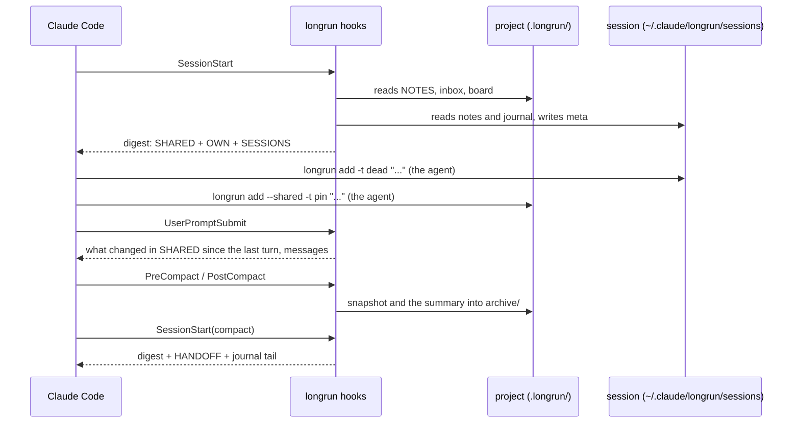

English | [Русский](README.ru.md)

<p align="center">
  
</p>

<h1 align="center">longrun</h1>

<p align="center">
  Memory and coordination for Claude Code sessions.<br>
  Notes that survive compaction. Sessions that message each other and hand out tasks.<br>
  Waiting that never oversleeps: no polling loop, the session wakes when the event fires.<br>
  One session that drives the rest to the goal.
</p>

<p align="center">
  <a href="#quick-start">Quick start</a> ·
  <a href="#four-ways-sessions-coordinate">Four ways to coordinate</a> ·
  <a href="#how-it-works">How it works</a> ·
  <a href="#commands">Commands</a> ·
  <a href="docs/REFERENCE.md">Reference</a> ·
  <a href="https://krllx.github.io/longrun/course/">Course</a>
</p>

<p align="center">
  
  
  
  
  
  
</p>

<p align="center">
  <a href="https://krllx.github.io/longrun/course/"></a>
</p>

---

## Quick start

```bash
git clone https://github.com/<you>/longrun-skill && cd longrun-skill
./install.sh            # skill, 11 hooks, CLI ~/.local/bin/longrun, MCP server
longrun watch install   # the timer: watches and the watcher every 5 minutes
cd ~/projects/shop && longrun init   # in the folder you open in Claude Code
```

Then, in a Claude Code session in that folder:

```
/longrun onboard
```

(or just say **"set up longrun"**). The agent explains the skill, asks about the main settings one at a time and applies them. The one thing a hook cannot set is the autocompact window: it asks you to type `/autocompact 300k`.

From there, nothing to call. You can talk in words: *"write that down"*, *"what have we tried"*, *"session status"*, *"hand it to the other session"*, *"tell me when the PR merges"*.

> **How it works inside, with examples:** [the course](https://krllx.github.io/longrun/course/) - eleven short parts, about 15 minutes.

<details>
<summary><b>Desktop notifications</b> - <code>./install.sh</code> sets them up; what it does and how to opt out</summary>

longrun never depends on them: a halt, a budget stop and a watch that came true reach the session itself through its socket or inbox, and the whole test suite runs with notifications off. They are an extra way to notice those while you are looking elsewhere, so the installer turns them on rather than making you read about it first. `./install.sh --no-notify` skips the whole thing.

What it does, by system:

- **macOS**: `brew install terminal-notifier` if it is missing (Homebrew is the prerequisite; without it the installer says so and moves on), then builds `~/.claude/longrun/notifier/longrun.app` and sends one test notification. macOS may ask once whether to allow notifications from "longrun" - allow it. There is no built-in route to replace this: `osascript -e 'display notification'` posts on behalf of Script Editor, which holds no notification permission, so the system files the notification, draws nothing and exits 0. Verified on macOS 15: 25 of 25 filed, 0 drawn, and Script Editor gains no permission even after being launched. The copy exists because the icon and the sender name come only from the bundle that posted the notification - this one carries the Claude icon and the name `longrun`.
- **Linux**: `notify-send` (`libnotify-bin` on Debian/Ubuntu, `libnotify` on Fedora), which most desktops already have. The installer only reports whether it is there.

`longrun notify --test` is the check either way: it sends a probe, reads back whether the system really drew it, and prints what a click on it opens (the session it is about).

One macOS quirk this makes up for: Claude Code's own "the session finished a turn" notification is sent silent and passive, so macOS files it without a banner. `longrun config set notify_turn_end unfocused --global` adds the loud version, only while the Claude window is not in front.

One session you must not miss - `longrun important`. `unfocused` still says nothing while you are typing in a *different* Claude session, which is exactly when a long-running one finishes and waits for you. Flag it and its turn ends always notify, whatever `notify_turn_end` says and whichever window is in front:

```bash
longrun important on      # every turn end, until you drop the flag
longrun important next    # the next turn end only, then it clears itself
longrun important 3       # the next three
longrun important off     # drop it
longrun important --to "PR 42: checkout drawer" next   # flag another session by its sidebar title
```

The flag lives with the session, so it survives compaction, `/clear` and a resume; `longrun status` shows it and `longrun important` with no argument lists every flagged session of the project.

</details>

## Why

| Without longrun | With longrun |
|---|---|
| Compaction squeezes the history into a summary, and the reasons go first. Half an hour later the agent proposes the fix it already reverted. | **Notes on disk.** One line per dead end, decision and fact. Shared ones every session sees, own ones that come back after every compaction, `/clear` and resume. |
| A second session does not know the first one exists. One opened a PR, the other says "the PR is not created yet". | **Messages and tasks.** A session sends a message or hands out a task, and it arrives in the other session as a user turn. |
| "Tell me when the PR merges" turns into a polling loop that burns tokens, or into a sleep that oversleeps. | **Watches.** launchd checks the condition every five minutes without a model and wakes the session when it holds. Reliable, reactive, free. |
| Five sessions on one project, and the human is the only one who knows what is done, stuck and next. | **An orchestrator.** One session keeps the board, hands out tasks, spots stuck peers, and asks the human through a dialog only when it must. |

One python script with no dependencies: the CLI, the 11 hooks and the MCP server are the same file.

## Four ways sessions coordinate

### 1. Shared documents on disk

One `.longrun/` per project holds the notes every session sees. Each session also keeps its own notes, outside the repository tree. Hooks bring both back after every compaction, `/clear` and resume, and show on every turn what other sessions changed.

```bash
longrun add --shared -t pin "PR 42 = branch feature/checkout"     # for every session
longrun add -t dead "retry on 429 does not help, limit is per org"  # for this one
longrun recall 429                                                  # search everything
```

### 2. Delegation to the session that has the context

A message to another session arrives as a user turn. A running session gets it right away through its socket. A stopped one gets it from the project inbox on its next turn, or `--resume` wakes it headless. Sessions are named the way you see them: the sidebar title.

```bash
longrun send "PR 43: payments" "PR 42 merged, rebase onto main"
longrun board assign T8 "PR 43: payments"      # a task instead of a message
```

### 3. Reactivity: wait without spending tokens

A watch is a deterministic check that a timer runs every five minutes with no model involved (a launchd agent on macOS, a systemd user timer or a cron job on Linux). When the condition holds, the session gets the text as a message. A laptop asleep just delays the check.

```bash
longrun watch add --to "PR 43: payments" --then "rebase onto main" -- pr-merged 42
longrun watch add --then "check the deploy" -- at 10:00
```

Checks: `pr-merged` (GitHub via `gh`, Arcadia via `arc`), `pr-status`, `at`, `file`, `http`, `cmd`.

### 4. Selective autonomy: one session drives the others

One session takes the orchestrator role and keeps a board: the goal, tasks, facts from outside. Workers take, finish and block tasks. Each move wakes the orchestrator, which hands out the next task, resolves blocks, or asks you through a dialog in front of every window. It does not poll and does not spawn sessions: you open them, it gives you the first line to paste.

```bash
longrun orchestrate start --goal "ship the checkout drawer"    # in the driving session
longrun board take T7; longrun board done T7 "PR 42 merged"    # in a worker
longrun ask "Merge PR 42?" --options "Yes,No"                  # a dialog, answered inline
```

The human keeps the levers: killing a stuck process (`longrun interrupt`), stopping every session (`longrun halt`), lifting the stop. The watcher and the orchestrator only propose. A 5-hour usage budget halts everything on a breach and asks you what to do.

## How it works



**Start.** The hook finds the project by directory and prints the digest: shared notes, own notes, the other sessions (alive or not, what each did last), pending watches, undelivered messages.

**Work.** The agent writes one line per dead end, decision or hard-won fact. Hooks count edits and log failed commands. After a long stretch of edits without a note, one reminder.

**Every turn.** Messages from the inbox are delivered. Changes other sessions made to the shared notes appear as a diff: `+` added, `~` rewritten, `-` removed.

**Compaction.** Before it, a snapshot of the last requests, edited files and recent failures - plus the instructions for the summariser itself: keep the dead ends with their reasons, keep exact strings, drop what one Read brings back. Claude Code builds the same summary prompt for an automatic compaction as for `/compact <text>`, so this is the same steering, done for you and without the timing. After it, the summary is archived verbatim. The next start prints the digest plus a HANDOFF block, so the session continues from the same place. Resume and `/clear` continue the same notes; a fork gets a copy.

**Cleanup.** Once an hour: old entries to the archive (except `pin`), journals trimmed, silent sessions archived. `add` refuses when a budget is full and names what to drop. Nothing is evicted silently.

## Three entities

| Entity | What it is | Stores |
|---|---|---|
| **Project** | One `.longrun/` directory, in the project folder or outside the tree (`--external`) | Shared notes, inbox, board, archive |
| **Session** | One Claude Code conversation; in the app, one row in the sidebar. A resume gets a new id and longrun links them | Own notes, journal, counters, last status |
| **Directory** | The folder where the session started: a repo root, a worktree, a subdirectory | Nothing. It only says which project the session belongs to |

A worktree is attached with `longrun link <project>` and has no notes of its own.

## What to write

One test: **would one command, Read or grep get this back?** If yes, do not write it.

| Tag | What | Where |
|---|---|---|
| `dead` | an approach that failed, and why | own; shared if another session could walk into it |
| `decision` | a choice and its reason | shared if it concerns others |
| `fact` | a fact about the environment that cost effort | shared |
| `pin` | a fact with no expiry: PR number, branch, host | shared |
| `ctx` | task framing from the human | own |
| `todo` | a short follow-up the agent owes | own |

Milestones (pushed, PR opened, tests green) go to the journal: `longrun log "PR opened"`. What outlives the task (who the user is, how they work) goes to Claude Code's auto memory, not here.

## Commands

```bash
longrun init [--external] | link <project> | where | onboard | config
longrun add [--shared] -t TAG "..." | rm | replace | notes | prune | log "..." | recall <term>
longrun status | send [--list] [--resume] WHO "..."
longrun watch add --to WHO --then "..." -- pr-merged 42 | at 10:00 | cmd '...' | file /path | http URL
longrun orchestrate start --goal "..." | board | fact | ask | halt | resume | interrupt | budget
```

Full flags, file formats and verified facts: [docs/REFERENCE.md](docs/REFERENCE.md). The orchestrator's design and what is left: [docs/ORCHESTRATOR.md](docs/ORCHESTRATOR.md).

<!-- site: nuances, limits and edge cases move to the site; add the link here -->

<details>
<summary><b>FAQ</b></summary>

**The agent says "the PR is not created yet" although it exists.** The fact is not in the shared notes: `longrun add --shared -t pin "PR 42 = branch feature/checkout"`.

**A session in a worktree does not see the project notes.** `longrun where` must show the project. If it says "not initialised": `longrun link <project>` from that worktree.

**A message was sent and the session is silent.** `longrun send --list`: a "stopped" recipient has it in the inbox and gets it on its next turn. Need it now: `--resume`.

**A watch never fires.** `longrun watch status`, `longrun watch ls --all`, `longrun watch test -- <the same check>`. The usual cause is a relative path or a shell alias inside `cmd`.
</details>

## Development

```bash
bash tests/run.sh            # 202 regression checks, no API calls
bash tests/scenarios.sh      # 30 scenarios, one per goal
bash tests/orchestrator.sh   # 64: the orchestrator layer
bash tests/ask.sh            # 30: the dialog and the MCP server
```

The installer copies files into `~/.claude/skills/longrun/`; nothing is loaded from the checkout. New hooks and CLI work in every running session at once, because a hook is a separate process per event. Requires macOS or Linux, Claude Code and python3 (3.9+), with no dependencies. One optional prerequisite, only if you want desktop notifications: Homebrew on macOS (the installer uses it to add terminal-notifier), libnotify on Linux.

## License

[MIT](LICENSE)
