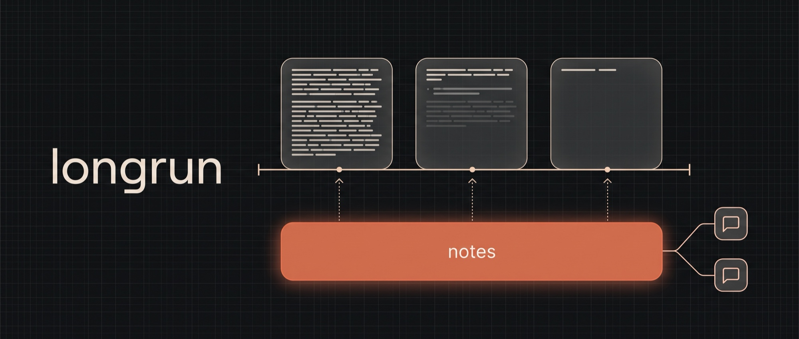
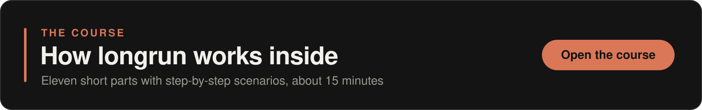
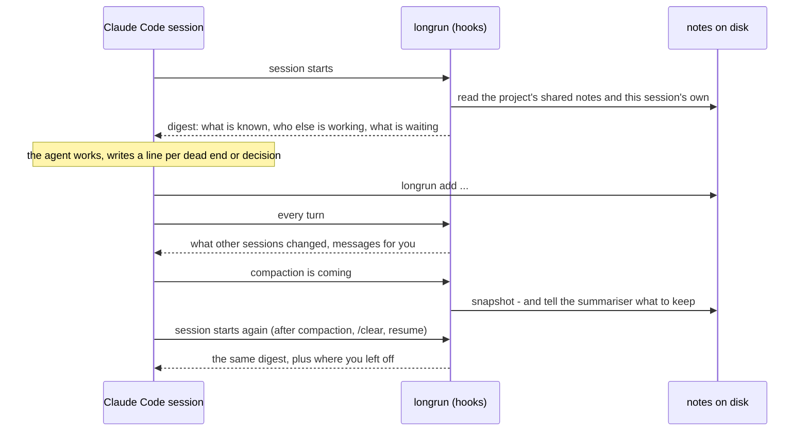

English | [Русский](README.ru.md) | [简体中文](README.zh-CN.md) | [日本語](README.ja.md) | [한국어](README.ko.md)

<p align="center">
  
</p>

<h1 align="center">longrun</h1>

<p align="center">
  Memory and coordination for Claude Code sessions.<br>
  A project that keeps its own state on disk, written and kept in order by the agents themselves.<br>
  Every session sees what the project knows and who else is working on it.<br>
  Work goes to the session that has the context; waiting is reliable and costs nothing.<br>
  One session can drive the rest - and reach you when only you can decide.
</p>

<p align="center">
  <a href="#quick-start">Quick start</a> ·
  <a href="#four-ways-sessions-coordinate">Four ways to coordinate</a> ·
  <a href="#how-it-works">How it works</a> ·
  <a href="#commands">Commands</a> ·
  <a href="docs/REFERENCE.md">Reference</a> ·
  <a href="https://krllx.github.io/longrun/course/">Course</a>
</p>

<p align="center">
  
  
  
  
  
  
</p>

<p align="center">
  <a href="https://krllx.github.io/longrun/course/"></a>
</p>

---

## Quick start

```bash
curl -fsSL https://krllx.github.io/longrun/install.sh | bash
```

> [!NOTE]
> The installer adds the skill with its `longrun` command for the terminal, hooks in `~/.claude/settings.json`, and a five-minute timer in the background. It asks whether to set up desktop notifications. `install.sh --uninstall` takes it all back.

<details>
<summary>What exactly it changes on this machine</summary>

- `~/.claude/settings.json` - 11 hook entries and two permission rules that let the agent call `longrun`. The file is copied to `~/.claude/backups/` first, and hooks that longrun did not add are left untouched.
- `~/.claude/skills/longrun/` and the symlink `~/.local/bin/longrun`.
- the MCP server `longrun` in user scope (`claude mcp add`), which is where the `ask` and `notify` tools come from.
- **a background timer**, every five minutes: a launchd agent on macOS, a systemd user timer or a cron line on Linux. It checks the watches you registered and looks at the sessions - a few shell checks, no model and no tokens, and it wakes a session only when one of your conditions comes true. `--no-timer` skips it.
- **desktop notifications**, if you answered yes to the installer's question: on macOS `brew install terminal-notifier` when it is missing, plus one test notification that makes macOS ask for permission. On Linux it only checks for `notify-send`. `--notify` and `--no-notify` answer the question in advance.

Needs macOS or Linux, Claude Code and python3 3.9+. From a clone it is the same [`install.sh`](install.sh).

</details>

Then open a project in Claude Code - one already open counts - and say **"set up longrun"**. Or from the terminal:

```bash
cd ~/my-project && longrun init && claude "set up longrun"
```

From there, nothing to call: *"write that down"*, *"what have we tried"*, *"tell me when the PR merges"*.

> **How it works inside, with examples:** [the course](https://krllx.github.io/longrun/course/) - eleven short parts, about 15 minutes.

<details>
<summary><b>Desktop notifications</b> - what they are for, and what the installer asks about</summary>

- **Why:** the session learns about a halt, a fired watch and a finished turn either way; a banner is how *you* notice one while looking at another window. longrun never depends on them.
- **macOS:** `terminal-notifier` via Homebrew (nothing built in draws a banner) and one permission prompt. Said no at install time? `brew install terminal-notifier` later.
- **Linux:** `notify-send` (`libnotify`), which most desktops already have.

`longrun notify --test` checks that one really reaches the screen. Two settings worth a look: `notify_turn_end unfocused` (a banner when a session finishes a turn while the Claude window is not in front) and `longrun important on|next` for the one session you must not miss. The `notify` tool the agent calls comes from the `longrun` MCP server the installer registers. The full story, macOS quirks included: [docs/REFERENCE.md](docs/REFERENCE.md).

</details>

## In short

**By itself, from the first session:** the project keeps a set of notes on disk that the agents write, re-read and prune themselves - dead ends, decisions, facts. Every session starts knowing what is in them, which other sessions exist and what each one did last, and every turn shows what the others changed since.

**When you ask, or the agent sees the need:** work is handed to the session that already has the context; "tell me when the PR merges" becomes a watch that spends no tokens waiting and cannot be slept through; a notification reaches you for the session you must not miss; one session coordinates the others toward the goal you set and puts a dialog in front of you when only you can unblock it.

**And along the way:** notes on disk do not degrade, so the hooks bring them back after every compaction, `/clear` and resume. That part matters less than it used to - the same hooks now tell the summariser what to keep, so an ordinary compaction already loses less than it did.

## Why

| Without longrun | With longrun |
|---|---|
| Everything a session worked out lives inside that one conversation. The next one - tomorrow's, or the one in the other window - starts from nothing and asks you what is going on. | **A project that remembers.** One `.longrun/` per project: notes the agents write, re-read and prune themselves. Every session starts with them, plus who else is working and what each did last. |
| A second session does not know the first one exists. One opened a PR, the other says "the PR is not created yet". | **Messages and tasks.** Work goes to the session that already has the context, and arrives there as a user turn. A stopped session too: it waits in the project inbox. |
| "Tell me when the PR merges" turns into a polling loop that burns tokens, or into a fixed sleep that ends long after the event, or before it. | **Watches.** A background timer checks the condition every five minutes without a model and wakes the session when it holds. Reliable, reactive, free. |
| Five sessions on one project, and you are the only one who knows what is done, stuck and next - and the only one who notices when one of them is waiting for you. | **An orchestrator.** One session keeps the board for the others, spots a peer that is stuck, and puts a dialog in front of every window when only you can decide. |
| Compaction squeezes the history into a summary, and the reasons go first: why an approach was dropped, why this path was taken. | **Notes on disk do not degrade,** and the hooks re-inject them afterwards. They also tell the summariser what to keep, so the compaction itself loses less. |

One python file, no dependencies.

## Claude Code already does some of this

longrun is for what outlives a turn and a session. Reach for the built-in thing first:

- **One session working toward one checkable condition** -> `/goal`: it keeps that session going until a separate evaluator confirms the condition holds. longrun has a board and persuasion, not an evaluator.
- **Splitting work inside a single turn** -> subagents and workflows: parallel, joined, and gone when the turn ends.
- **What outlives the task itself** - who you are, how you work, standing conventions -> Claude Code's auto memory.
- **A message to a session that is running right now** -> the built-in `SendMessage`; `ListAgents` lists what is running.
- **Several windows, over hours and days** -> longrun: state that outlives every turn, a stopped session you can still write to, waiting that costs no tokens, and one session coordinating the rest.

## Four ways sessions coordinate

> [!NOTE]
> The commands below are what the agents run for themselves - the skill tells them when to write a note, when to send a message, when to set a watch. Nothing here is a command set to memorise: you say *"write that down"* or *"tell me when the PR merges"*, or nothing at all. They are shown because you can run any of them by hand when you want to.

### 1. Shared documents on disk

One `.longrun/` per project holds the notes every session sees - that is where a note goes by default. A session can keep something to itself with `--own`, outside the repository tree. Hooks bring both back after every compaction, `/clear` and resume, and show on every turn what other sessions changed.

```bash
longrun add -t pin "PR 42 = branch feature/checkout"           # shared: every session sees it
longrun add --own -t ctx "only the checkout drawer, not the cart"  # this conversation only
longrun doc add research/plan.md "the rollout plan and what is open"
longrun recall 429                                             # notes, those files, journals, transcripts
```

### 2. Delegation to the session that has the context

A message to another session arrives as a user turn. A running session gets it right away through its socket. A stopped one gets it from the project inbox on its next turn; only when you pass `--resume` is it woken right away, as a `claude -p` run in the background, which spends tokens. A session is addressed by the title you see in the sidebar.

Claude Code can do the first half of this on its own: `SendMessage` writes to a session that is **running**, and `ListAgents` lists the ones that are. What `longrun send` adds is the rest - a session that is stopped (the message waits in the inbox), addressing by the sidebar title rather than a session id, `--resume` to wake one headless, and the same path used by a fired watch and by the board, neither of which has a model to call a tool for them.

```bash
longrun send "PR 43: payments" "PR 42 merged, rebase onto main"
longrun board assign T8 "PR 43: payments"      # a task instead of a message
```

### 3. Event-driven: wait without spending tokens

A watch is a fixed check with no model judgement in it, run by a timer every five minutes (a launchd agent on macOS, a systemd user timer or a cron job on Linux). When the condition holds, the session gets the `--then` text as a message. A laptop asleep just delays the check.

```bash
longrun watch add --to "PR 43: payments" --then "rebase onto main" -- pr-merged 42
longrun watch add --then "check the deploy" -- at 10:00
```

Checks: `pr-merged` (GitHub via `gh`), `pr-status`, `at`, `file`, `http`, `cmd`.

### 4. One session coordinates the rest - and reaches you when it has to

One session takes the orchestrator role and keeps a board: the goal, tasks, facts from outside. Workers take, finish and flag tasks as blocked. Each change on the board wakes the orchestrator, which hands out the next task, resolves blocks, or asks you through a dialog in front of every window. It does not poll and does not start sessions by itself: in the desktop app it leaves a chip that opens one when you click it, in the terminal it gives you the first line to paste.

This is coordination across several windows plus a line to you, not autonomy: driving **one** session to a condition an evaluator can check is what `/goal` is for.

```bash
longrun orchestrate start --goal "ship the checkout drawer"    # in the coordinating session
longrun board take T7; longrun board done T7 "PR 42 merged"    # in a worker
longrun board add --fact "reviewer wants the field renamed"    # something learned outside
longrun ask "Merge PR 42?" --options "Yes,No"                  # a dialog, answered inline
```

Control stays with you. The orchestrator and the watcher only propose: they can message a session, put a question in front of you, and stop every session at once with `longrun halt` - which only you lift. Nothing kills a running tool; the window that is stuck is yours to stop, with Esc.

## How it works



**Start.** The hook finds the project by directory and prints the digest: shared notes, own notes, the other sessions (alive or not, what each did last), pending watches, undelivered messages.

**Work.** The agent writes one line per dead end, decision or hard-won fact. Hooks count edits and log failed commands. After a long stretch of edits without a note, one reminder to the agent to write one.

**Every turn.** Messages from the inbox are delivered. Changes other sessions made to the shared notes appear as a diff: `+` added, `~` rewritten, `-` removed.

**Compaction.** Before it, a snapshot of the last requests, edited files and recent failures - plus the instructions for the summariser: keep the dead ends with their reasons, keep exact strings, drop what one file read brings back. Claude Code builds the same summary prompt for an automatic compaction as for `/compact <text>`, so this is the same instruction, sent for you at the right moment. After it, the summary is archived verbatim. The next start prints the digest plus a HANDOFF block, so the session continues from the same place. Resume and `/clear` continue the same notes; a fork gets a copy.

**Cleanup.** Once an hour: old entries to the archive (except `pin`), journals trimmed, silent sessions archived. `add` refuses when the notes limit is full and names what to drop. Nothing is evicted silently.

## Three entities

| Entity | What it is | Stores |
|---|---|---|
| **Project** | One `.longrun/` directory, in the project folder or outside the tree (`--external`) | Shared notes, inbox, board, archive |
| **Session** | One Claude Code conversation; in the app, one row in the sidebar. A resume gets a new id and longrun links the old id to the new one | Own notes, journal, counters, last status |
| **Directory** | The folder where the session started: a repo root, a worktree, a subdirectory | Nothing. It only says which project the session belongs to |

A worktree is attached with `longrun link <project>` and has no note store of its own.

## What to write

One test: **would one command, one file read or grep get this back?** If yes, do not write it. Too long for one line? Then it is a file, and the notes carry a pointer to it: `longrun doc add research/plan.md "the rollout plan and what is still open"`. Every session sees the pointer at every start and opens the file only when it needs it.

| Tag | What | Where |
|---|---|---|
| `dead` | an approach that failed, and why | own; shared if another session could hit the same dead end |
| `decision` | a choice and its reason | shared if it concerns others |
| `fact` | a fact about the environment that cost effort | shared |
| `pin` | a fact with no expiry: PR number, branch, host | shared |
| `ctx` | task framing from the human | own |
| `doc` | a pointer to a file too long for a note: `longrun doc add <path> "what is in it"` | shared |

A note that stopped being true is not deleted behind everyone's back: `longrun stale n12 "staging moved to vla-07"` marks it, every session sees the mark, and the next cleanup takes marked entries first. `longrun mute n12` just takes one out of *your* digest and changes nothing for anybody else.

The journal keeps the mechanical record by itself - what was edited, what failed, when a compaction happened - so progress narration is not something to write down. What outlives the task (who the user is, how they work) goes to Claude Code's auto memory, not to longrun.

## Commands

```bash
longrun init [--external] | link <project> | where | onboard | config
longrun add [--own] -t TAG "..." | rm | replace | stale | mute | notes | prune | recall <term>
longrun doc add <path> "what is in it" | doc ls | doc touch n12 "..." 
longrun status | send [--list] [--resume] WHO "..."
longrun watch add --to WHO --then "..." -- pr-merged 42 | at 10:00 | cmd '...' | file /path | http URL
longrun orchestrate start --goal "..." | board [add --fact|ack] | ask | halt | resume
```

Full flags, file formats and the facts we verified about Claude Code: [docs/REFERENCE.md](docs/REFERENCE.md). The orchestrator's design and what is left: [docs/ORCHESTRATOR.md](docs/ORCHESTRATOR.md).

<!-- site: nuances, limits and edge cases move to the site; add the link here -->

<details>
<summary><b>FAQ</b></summary>

**The agent says "the PR is not created yet" although it exists.** The fact is not in the shared notes: `longrun add -t pin "PR 42 = branch feature/checkout"`.

**A session in a worktree does not see the project notes.** `longrun where` must show the project. If it says "not initialised": `longrun link <project>` from that worktree.

**A message was sent and the session is silent.** `longrun send --list`: a "stopped" recipient has it in the inbox and gets it on its next turn. Need it now: `--resume`.

**A watch never fires.** `longrun watch status`, `longrun watch ls --all`, `longrun watch test -- <the same check>`. The usual cause is a relative path or a shell alias inside `cmd`.
</details>

## Development

```bash
bash tests/run.sh            # 222 regression checks, no API calls
bash tests/scenarios.sh      # 37 scenarios, one per goal
bash tests/orchestrator.sh   # 51: the orchestrator layer
bash tests/ask.sh            # 27: the dialog and the MCP server
```

The installer copies files into `~/.claude/skills/longrun/`; nothing is loaded from the checkout. A running session picks an update up without a restart, because a hook is a separate process per event.

## License

[MIT](LICENSE)
