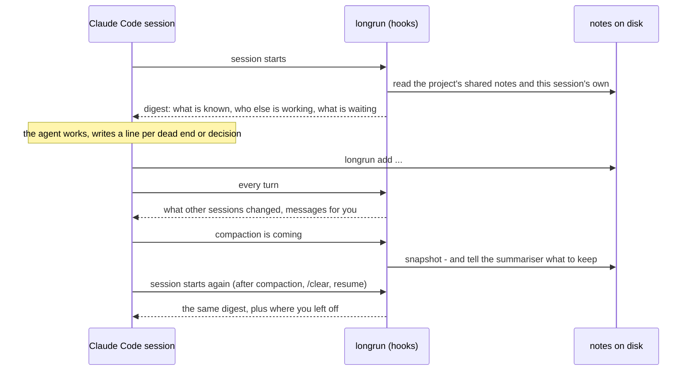

English | [Русский](README.ru.md) | [简体中文](README.zh-CN.md) | [日本語](README.ja.md) | [한국어](README.ko.md)

<p align="center">
  
</p>

<h1 align="center">longrun</h1>

<p align="center">
  Memory and coordination for Claude Code sessions.<br>
  Notes that survive compaction. Sessions that message each other and hand out tasks.<br>
  Waiting that never oversleeps: no polling loop, the session wakes when the event fires.<br>
  One session that drives the rest to the goal.
</p>

<p align="center">
  <a href="#quick-start">Quick start</a> ·
  <a href="#four-ways-sessions-coordinate">Four ways to coordinate</a> ·
  <a href="#how-it-works">How it works</a> ·
  <a href="#commands">Commands</a> ·
  <a href="docs/REFERENCE.md">Reference</a> ·
  <a href="https://krllx.github.io/longrun/course/">Course</a>
</p>

<p align="center">
  
  
  
  
  
  
</p>

<p align="center">
  <a href="https://krllx.github.io/longrun/course/"></a>
</p>

---

## Quick start

```bash
curl -fsSL https://raw.githubusercontent.com/krllx/longrun/main/install.sh | bash
```

> [!NOTE]
> The installer adds the skill with its `longrun` command for the terminal, hooks in `~/.claude/settings.json`, and a five-minute timer in the background. It asks before setting up desktop notifications. `install.sh --uninstall` takes it all back.

<details>
<summary>What exactly it changes on this machine</summary>

- `~/.claude/settings.json` - 11 hook entries and two permission rules that let the agent call `longrun`. The file is copied to `~/.claude/backups/` first, and hooks that are not ours are left untouched.
- `~/.claude/skills/longrun/` and the symlink `~/.local/bin/longrun`.
- the MCP server `longrun` in user scope (`claude mcp add`), which is where the `ask` and `notify` tools come from.
- **a background timer**, every five minutes: a launchd agent on macOS, a systemd user timer or a cron line on Linux. It checks the watches you registered and looks at the sessions - a few shell checks, no model and no tokens, and it wakes a session only when one of your conditions comes true. `--no-timer` skips it.
- **desktop notifications**, if you say yes to the question: on macOS `brew install terminal-notifier` when it is missing, a sender bundle under `~/.claude/longrun/notifier/`, and one test notification that makes macOS ask for permission. On Linux it only checks for `notify-send`. `--notify` and `--no-notify` answer the question in advance.

Needs macOS or Linux, Claude Code and python3 3.9+. From a clone it is the same [`install.sh`](install.sh).

</details>

Then open a project in Claude Code - one already open counts - and say **"set up longrun"**. Or from the terminal:

```bash
cd ~/my-project && longrun init && claude "set up longrun"
```

From there, nothing to call: *"write that down"*, *"what have we tried"*, *"tell me when the PR merges"*.

> **How it works inside, with examples:** [the course](https://krllx.github.io/longrun/course/) - eleven short parts, about 15 minutes.

<details>
<summary><b>Desktop notifications</b> - what they are for, and what the installer asks about</summary>

- **Why:** a halt, a fired watch and a finished turn reach the session either way; a banner is how *you* notice one while looking at another window. longrun never depends on them.
- **macOS:** `terminal-notifier` via Homebrew (nothing built in draws a banner) and one permission prompt. Said no at install time? `longrun notify setup` later.
- **Linux:** `notify-send` (`libnotify`), which most desktops already have.

`longrun notify --test` checks that one really reaches the screen. Two settings worth a look: `notify_turn_end unfocused` (a banner when a session finishes a turn while the Claude window is not in front) and `longrun important on|next` for the one session you must not miss. The `notify` tool the agent calls comes from the `longrun` MCP server the installer registers. The full story, macOS quirks included: [docs/REFERENCE.md](docs/REFERENCE.md).

</details>

## In short

**By itself, from the first session:** the agent keeps notes on disk - dead ends, decisions, facts - and the hooks bring them back after every compaction, `/clear` and resume; the summariser is told what to keep; every turn shows what other sessions of the project changed.

**When you ask, or the agent sees the need:** "tell me when the PR merges" (a watch that spends no tokens waiting), messages and tasks between sessions, a notification when the session you care about finishes, one session driving the others to a goal.

## Why

| Without longrun | With longrun |
|---|---|
| Compaction squeezes the history into a summary, and the reasons go first. Half an hour later the agent proposes the fix it already reverted. | **Notes on disk.** One line per dead end, decision and fact. Shared ones every session sees, own ones that come back after every compaction, `/clear` and resume. |
| A second session does not know the first one exists. One opened a PR, the other says "the PR is not created yet". | **Messages and tasks.** A session sends a message or hands out a task, and it arrives in the other session as a user turn. |
| "Tell me when the PR merges" turns into a polling loop that burns tokens, or into a sleep that oversleeps. | **Watches.** launchd checks the condition every five minutes without a model and wakes the session when it holds. Reliable, reactive, free. |
| Five sessions on one project, and the human is the only one who knows what is done, stuck and next. | **An orchestrator.** One session keeps the board, hands out tasks, spots stuck peers, and asks the human through a dialog only when it must. |

One python file, no dependencies.

## Four ways sessions coordinate

> [!NOTE]
> The commands below are what the agents run for themselves - the skill tells them when to write a note, when to send a message, when to set a watch. Nothing here is a command set to memorise: you say *"write that down"* or *"tell me when the PR merges"*, or nothing at all. They are shown because you can run any of them by hand when you want to.

### 1. Shared documents on disk

One `.longrun/` per project holds the notes every session sees. Each session also keeps its own notes, outside the repository tree. Hooks bring both back after every compaction, `/clear` and resume, and show on every turn what other sessions changed.

```bash
longrun add --shared -t pin "PR 42 = branch feature/checkout"     # for every session
longrun add -t dead "retry on 429 does not help, limit is per org"  # for this one
longrun recall 429                                                  # search everything
```

### 2. Delegation to the session that has the context

A message to another session arrives as a user turn. A running session gets it right away through its socket. A stopped one gets it from the project inbox on its next turn; only when you pass `--resume` is it woken right away, as a `claude -p` run in the background, which spends tokens. Sessions are named the way you see them: the sidebar title.

```bash
longrun send "PR 43: payments" "PR 42 merged, rebase onto main"
longrun board assign T8 "PR 43: payments"      # a task instead of a message
```

### 3. Reactivity: wait without spending tokens

A watch is a deterministic check that a timer runs every five minutes with no model involved (a launchd agent on macOS, a systemd user timer or a cron job on Linux). When the condition holds, the session gets the text as a message. A laptop asleep just delays the check.

```bash
longrun watch add --to "PR 43: payments" --then "rebase onto main" -- pr-merged 42
longrun watch add --then "check the deploy" -- at 10:00
```

Checks: `pr-merged` (GitHub via `gh`), `pr-status`, `at`, `file`, `http`, `cmd`.

### 4. Selective autonomy: one session drives the others

One session takes the orchestrator role and keeps a board: the goal, tasks, facts from outside. Workers take, finish and block tasks. Each move wakes the orchestrator, which hands out the next task, resolves blocks, or asks you through a dialog in front of every window. It does not poll and does not start sessions by itself: in the desktop app it leaves a chip that opens one when you click it, in the terminal it gives you the first line to paste.

```bash
longrun orchestrate start --goal "ship the checkout drawer"    # in the driving session
longrun board take T7; longrun board done T7 "PR 42 merged"    # in a worker
longrun ask "Merge PR 42?" --options "Yes,No"                  # a dialog, answered inline
```

The human keeps the levers: killing a stuck process (`longrun interrupt`), stopping every session (`longrun halt`), lifting the stop. The watcher and the orchestrator only propose. Optional and off until you turn it on: a 5-hour usage budget (`longrun budget on`) that halts everything when the window runs ahead of plan and asks you what to do.

## How it works



**Start.** The hook finds the project by directory and prints the digest: shared notes, own notes, the other sessions (alive or not, what each did last), pending watches, undelivered messages.

**Work.** The agent writes one line per dead end, decision or hard-won fact. Hooks count edits and log failed commands. After a long stretch of edits without a note, one reminder.

**Every turn.** Messages from the inbox are delivered. Changes other sessions made to the shared notes appear as a diff: `+` added, `~` rewritten, `-` removed.

**Compaction.** Before it, a snapshot of the last requests, edited files and recent failures - plus the instructions for the summariser itself: keep the dead ends with their reasons, keep exact strings, drop what one Read brings back. Claude Code builds the same summary prompt for an automatic compaction as for `/compact <text>`, so this is the same steering, done for you and without the timing. After it, the summary is archived verbatim. The next start prints the digest plus a HANDOFF block, so the session continues from the same place. Resume and `/clear` continue the same notes; a fork gets a copy.

**Cleanup.** Once an hour: old entries to the archive (except `pin`), journals trimmed, silent sessions archived. `add` refuses when a budget is full and names what to drop. Nothing is evicted silently.

## Three entities

| Entity | What it is | Stores |
|---|---|---|
| **Project** | One `.longrun/` directory, in the project folder or outside the tree (`--external`) | Shared notes, inbox, board, archive |
| **Session** | One Claude Code conversation; in the app, one row in the sidebar. A resume gets a new id and longrun links them | Own notes, journal, counters, last status |
| **Directory** | The folder where the session started: a repo root, a worktree, a subdirectory | Nothing. It only says which project the session belongs to |

A worktree is attached with `longrun link <project>` and has no notes of its own.

## What to write

One test: **would one command, Read or grep get this back?** If yes, do not write it.

| Tag | What | Where |
|---|---|---|
| `dead` | an approach that failed, and why | own; shared if another session could walk into it |
| `decision` | a choice and its reason | shared if it concerns others |
| `fact` | a fact about the environment that cost effort | shared |
| `pin` | a fact with no expiry: PR number, branch, host | shared |
| `ctx` | task framing from the human | own |
| `todo` | a short follow-up the agent owes | own |

Milestones (pushed, PR opened, tests green) go to the journal: `longrun log "PR opened"`. What outlives the task (who the user is, how they work) goes to Claude Code's auto memory, not here.

## Commands

```bash
longrun init [--external] | link <project> | where | onboard | config
longrun add [--shared] -t TAG "..." | rm | replace | notes | prune | log "..." | recall <term>
longrun status | send [--list] [--resume] WHO "..."
longrun watch add --to WHO --then "..." -- pr-merged 42 | at 10:00 | cmd '...' | file /path | http URL
longrun orchestrate start --goal "..." | board | fact | ask | halt | resume | interrupt | budget
```

Full flags, file formats and verified facts: [docs/REFERENCE.md](docs/REFERENCE.md). The orchestrator's design and what is left: [docs/ORCHESTRATOR.md](docs/ORCHESTRATOR.md).

<!-- site: nuances, limits and edge cases move to the site; add the link here -->

<details>
<summary><b>FAQ</b></summary>

**The agent says "the PR is not created yet" although it exists.** The fact is not in the shared notes: `longrun add --shared -t pin "PR 42 = branch feature/checkout"`.

**A session in a worktree does not see the project notes.** `longrun where` must show the project. If it says "not initialised": `longrun link <project>` from that worktree.

**A message was sent and the session is silent.** `longrun send --list`: a "stopped" recipient has it in the inbox and gets it on its next turn. Need it now: `--resume`.

**A watch never fires.** `longrun watch status`, `longrun watch ls --all`, `longrun watch test -- <the same check>`. The usual cause is a relative path or a shell alias inside `cmd`.
</details>

## Development

```bash
bash tests/run.sh            # 202 regression checks, no API calls
bash tests/scenarios.sh      # 30 scenarios, one per goal
bash tests/orchestrator.sh   # 67: the orchestrator layer
bash tests/ask.sh            # 30: the dialog and the MCP server
```

The installer copies files into `~/.claude/skills/longrun/`; nothing is loaded from the checkout. A running session picks an update up without a restart, because a hook is a separate process per event.

## License

[MIT](LICENSE)
