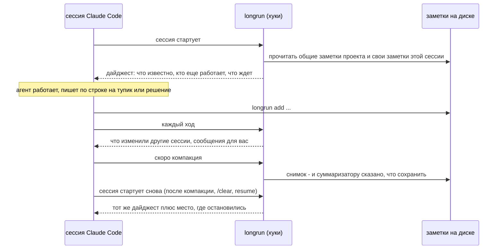

[English](README.md) | Русский | [简体中文](README.zh-CN.md) | [日本語](README.ja.md)

<p align="center">
  
</p>

<h1 align="center">longrun</h1>

<p align="center">
  Память и координация сессий Claude Code.<br>
  Заметки переживают компакцию. Сессии пишут друг другу и раздают задачи.<br>
  Ожидание, которое не проспит: без цикла опроса, сессия просыпается, когда событие наступило.<br>
  Одна сессия ведет остальные к цели.
</p>

<p align="center">
  <a href="#быстрый-старт">Быстрый старт</a> ·
  <a href="#четыре-способа-координации">Четыре способа координации</a> ·
  <a href="#как-это-работает">Как это работает</a> ·
  <a href="#команды">Команды</a> ·
  <a href="docs/REFERENCE.ru.md">Справочник</a> ·
  <a href="https://krllx.github.io/longrun/course/ru/">Курс</a>
</p>

<p align="center">
  
  
  
  
  
  
</p>

<p align="center">
  <a href="https://krllx.github.io/longrun/course/ru/"></a>
</p>

---

## Быстрый старт

```bash
curl -fsSL https://raw.githubusercontent.com/krllx/longrun/main/install.sh | bash
```

> [!NOTE]
> Установщик добавляет скилл с командой `longrun` для терминала, хуки в `~/.claude/settings.json` и таймер, который работает в фоне раз в пять минут. Про уведомления на рабочем столе он спрашивает. `install.sh --uninstall` снимает все обратно.

<details>
<summary>Что именно он меняет на машине</summary>

- `~/.claude/settings.json` - 11 хуков и два правила в permissions, которые разрешают агенту звать `longrun`. Файл сначала копируется в `~/.claude/backups/`, чужие хуки не трогаются.
- `~/.claude/skills/longrun/` и симлинк `~/.local/bin/longrun`.
- MCP-сервер `longrun` в user scope (`claude mcp add`) - из него берутся тулы `ask` и `notify`.
- **фоновый таймер** раз в пять минут: агент launchd на macOS, systemd user timer или строка в cron на Linux. Он проверяет заведенные watch и смотрит на сессии - это несколько shell-проверок, без модели и без токенов, а сессию будит только когда ваше условие сбылось. `--no-timer` пропускает.
- **уведомления на рабочем столе**, если ответить да на вопрос: на macOS `brew install terminal-notifier`, если его нет, бандл-отправитель в `~/.claude/longrun/notifier/` и одно тестовое уведомление, на котором macOS спрашивает разрешение. На Linux только проверяется наличие `notify-send`. `--notify` и `--no-notify` отвечают на вопрос заранее.

Нужны macOS или Linux, Claude Code и python3 3.9+. Из клона - тот же [`install.sh`](install.sh).

</details>

Дальше открыть проект в Claude Code - уже открытый тоже подходит - и сказать **"настрой longrun"**. Или из терминала:

```bash
cd ~/my-project && longrun init && claude "настрой longrun"
```

Дальше звать ничего не нужно: *"запиши"*, *"что мы уже пробовали"*, *"скажи, когда PR вольется"*.

> **Устройство скилла и примеры:** [курс](https://krllx.github.io/longrun/course/ru/) - одиннадцать коротких частей, около 15 минут.

<details>
<summary><b>Уведомления на рабочем столе</b> - зачем они и что спрашивает установщик</summary>

- **Зачем:** halt, сработавший watch и законченный ход и так доезжают до сессии; баннер нужен, чтобы *вы* заметили это, пока смотрите в другое окно. longrun от них не зависит.
- **macOS:** `terminal-notifier` через Homebrew (встроенного пути, который рисует баннер, нет) и один запрос разрешения. Ответили нет при установке? Потом - `longrun notify setup`.
- **Linux:** `notify-send` (`libnotify`), он есть в большинстве десктопов.

`longrun notify --test` проверяет, что уведомление правда доходит до экрана. Две настройки, на которые стоит взглянуть: `notify_turn_end unfocused` (баннер, когда сессия закончила ход, а окно Claude не в фокусе) и `longrun important on|next` для той сессии, которую нельзя пропустить. Тул `notify`, которым пользуется агент, приезжает из MCP-сервера `longrun`, который регистрирует установщик. Подробности и особенности macOS: [docs/REFERENCE.ru.md](docs/REFERENCE.ru.md).

</details>

## Коротко

**Само, с первой сессии:** агент ведет заметки на диске - тупики, решения, факты, - а хуки возвращают их после каждой компакции, `/clear` и resume; суммаризатору сказано, что сохранить; на каждом ходу видно, что изменили другие сессии проекта.

**По просьбе или когда агент сам видит нужду:** "скажи, когда PR вольется" (watch, который не тратит токены на ожидание), сообщения и задачи между сессиями, уведомление, когда закончила нужная вам сессия, одна сессия, ведущая остальные к цели.

## Зачем

| Без longrun | С longrun |
|---|---|
| Компакция сжимает историю в резюме, и первыми пропадают причины. Через полчаса агент предлагает правку, которую сам уже откатил. | **Заметки на диске.** По строке на тупик, решение и факт. Общие видят все сессии, свои возвращаются после каждой компакции, `/clear` и resume. |
| Вторая сессия не знает о первой. Одна открыла PR, другая говорит "PR еще не создан". | **Сообщения и задачи.** Сессия шлет сообщение или раздает задачу, и это приходит другой сессии как ход пользователя. |
| "Скажи, когда PR вольется" превращается в цикл опроса, который жжет токены, или в сон, который проспит. | **Watch.** launchd проверяет условие раз в пять минут без модели и будит сессию, когда оно выполнилось. Надежно, реактивно, бесплатно. |
| Пять сессий на одном проекте, и только человек знает, что сделано, что застряло и что дальше. | **Оркестратор.** Одна сессия ведет борд, раздает задачи, замечает застрявших и спрашивает человека диалогом только когда без него нельзя. |

Один python-файл, без зависимостей.

## Четыре способа координации

> [!NOTE]
> Команды ниже - это то, что агенты выполняют сами: скилл говорит им, когда записать заметку, когда отправить сообщение, когда завести watch. Заучивать тут нечего: вы говорите *"запиши"* или *"скажи, когда PR вольется"*, а чаще не говорите ничего. Они показаны потому, что при желании любую можно выполнить руками.

### 1. Общие документы на диске

Один `.longrun/` на проект хранит заметки, которые видят все сессии. У каждой сессии есть и свои заметки, вне дерева репозитория. Хуки возвращают и те и другие после каждой компакции, `/clear` и resume, а на каждом ходу показывают, что изменили другие сессии.

```bash
longrun add --shared -t pin "PR 42 = branch feature/checkout"     # для всех сессий
longrun add -t dead "retry on 429 does not help, limit is per org"  # для этой
longrun recall 429                                                  # поиск по всему
```

### 2. Делегирование той сессии, у которой есть контекст

Сообщение другой сессии приходит как ход пользователя. Работающая получает его сразу через свой сокет. Остановленная - из inbox проекта на следующем ходу; и только если вы передали `--resume`, ее будят сразу - запуском `claude -p` в фоне, а это токены. Сессии называются так, как их видит человек: заголовком в сайдбаре.

```bash
longrun send "PR 43: платежи" "PR 42 влит, перебазируйся на main"
longrun board assign T8 "PR 43: платежи"      # задача вместо сообщения
```

### 3. Реактивность: ждать, не тратя токены

Watch - это детерминированная проверка, которую таймер гоняет раз в пять минут без модели (launchd на macOS, systemd-таймер пользователя или cron на Linux). Когда условие выполнилось, сессия получает текст сообщением. Спящий ноутбук лишь откладывает проверку.

```bash
longrun watch add --to "PR 43: платежи" --then "перебазируйся на main" -- pr-merged 42
longrun watch add --then "проверь выкатку" -- at 10:00
```

Проверки: `pr-merged` (GitHub через `gh`), `pr-status`, `at`, `file`, `http`, `cmd`.

### 4. Выборочная самостоятельность: одна сессия ведет остальные

Одна сессия берет роль оркестратора и ведет борд: цель, задачи, факты снаружи. Рабочие сессии берут, закрывают и блокируют задачи. Каждый ход по борду будит оркестратора: он раздает следующую задачу, разбирает блокировки или спрашивает человека диалогом поверх всех окон. Он не поллит и не создает сессий: их открывает человек, оркестратор дает первую строку для вставки.

```bash
longrun orchestrate start --goal "довести корзину до релиза"   # в ведущей сессии
longrun board take T7; longrun board done T7 "PR 42 влит"      # в рабочей
longrun ask "Мержим PR 42?" --options "Да,Нет"                 # диалог, ответ приходит сразу
```

Рычаги остаются у человека: убить зависший процесс (`longrun interrupt`), остановить все сессии (`longrun halt`), снять остановку. Watcher и оркестратор только предлагают. По желанию и выключено, пока не включите: бюджет 5-часового окна (`longrun budget on`), который останавливает все, когда окно тратится быстрее плана, и спрашивает, что делать.

## Как это работает



**Старт.** Хук находит проект по каталогу и печатает дайджест: общие заметки, свои заметки, другие сессии (живы ли, что делали последним), ожидающие watch, недоставленные сообщения.

**Работа.** Агент пишет по строке на тупик, решение или добытый факт. Хуки считают правки и пишут упавшие команды в журнал. После долгой серии правок без заметки - одно напоминание.

**Каждый ход.** Доставляются сообщения из inbox. Изменения общих заметок другими сессиями приходят разницей: `+` добавлено, `~` переписано, `-` удалено.

**Компакция.** До нее - снимок последних просьб, правленых файлов и недавних падений, плюс инструкции самому суммаризатору: сохранить тупики с причинами, сохранить точные строки, выкинуть то, что вернет один Read. Промпт резюме у автокомпакции и у `/compact <текст>` один и тот же, так что это та же самая подсказка - но за вас и без ловли момента. После - резюме в архив дословно. Следующий старт печатает дайджест и блок HANDOFF, и сессия продолжает с того же места. Resume и `/clear` продолжают те же заметки, форк получает копию.

**Уборка.** Раз в час: старые записи в архив (кроме `pin`), журналы обрезаются, молчавшие сессии архивируются. `add` отказывает при полном бюджете и называет, что можно снести. Молча ничего не вытесняется.

## Три сущности

| Сущность | Что это | Что хранит |
|---|---|---|
| **Проект** | Один каталог `.longrun/`, в папке проекта или вне дерева (`--external`) | Общие заметки, inbox, борд, архив |
| **Сессия** | Один разговор Claude Code; в приложении - строка в сайдбаре. Resume выдает новый id, longrun их связывает | Свои заметки, журнал, счетчики, последний статус |
| **Каталог** | Папка, где сессия стартовала: корень репозитория, worktree, подкаталог | Ничего. Только говорит, к какому проекту относится сессия |

Worktree привязывается командой `longrun link <проект>` и своих заметок не имеет.

## Что писать

Тест один: **вернет ли это одна команда, Read или grep?** Если да, не писать.

| Тег | Что | Куда |
|---|---|---|
| `dead` | подход не сработал, и почему | свои; общие, если туда может зайти другая сессия |
| `decision` | выбор и причина | общие, если касается других |
| `fact` | факт об окружении, который стоил усилий | общие |
| `pin` | факт без срока давности: номер PR, ветка, хост | общие |
| `ctx` | рамки задачи от человека | свои |
| `todo` | короткий хвост за агентом | свои |

Вехи (запушил, PR открыт, тесты зеленые) - в журнал: `longrun log "PR opened"`. То, что переживет задачу (кто пользователь, как он работает), - в автопамять Claude Code, не сюда.

## Команды

```bash
longrun init [--external] | link <проект> | where | onboard | config
longrun add [--shared] -t TAG "..." | rm | replace | notes | prune | log "..." | recall <слово>
longrun status | send [--list] [--resume] КТО "..."
longrun watch add --to КТО --then "..." -- pr-merged 42 | at 10:00 | cmd '...' | file /путь | http URL
longrun orchestrate start --goal "..." | board | fact | ask | halt | resume | interrupt | budget
```

Все флаги, форматы файлов и проверенные факты: [docs/REFERENCE.ru.md](docs/REFERENCE.ru.md). Устройство оркестратора и что осталось: [docs/ORCHESTRATOR.ru.md](docs/ORCHESTRATOR.ru.md).

<!-- сайт: нюансы, границы и особые случаи переезжают на сайт; ссылку поставить здесь -->

<details>
<summary><b>Частые вопросы</b></summary>

**Агент говорит "PR еще не создан", хотя он есть.** Факта нет в общих заметках: `longrun add --shared -t pin "PR 42 = branch feature/checkout"`.

**Сессия в worktree не видит заметок проекта.** `longrun where` должен показать проект. Если пишет "not initialised": `longrun link <проект>` из этого worktree.

**Сообщение отправлено, а сессия молчит.** `longrun send --list`: адресат "stopped" - сообщение в inbox и придет на следующем ходу. Нужно сейчас: `--resume`.

**Watch не срабатывает.** `longrun watch status`, `longrun watch ls --all`, `longrun watch test -- <та же проверка>`. Частая причина - относительный путь или alias в `cmd`.
</details>

## Разработка

```bash
bash tests/run.sh            # 202 регрессионные проверки, без API
bash tests/scenarios.sh      # 30 сценариев, по одному на задачу
bash tests/orchestrator.sh   # 67: слой оркестратора
bash tests/ask.sh            # 30: диалог и MCP-сервер
```

Установщик копирует файлы в `~/.claude/skills/longrun/`; из репозитория само ничего не подхватывается. Идущая сессия подхватывает обновление без перезапуска, потому что хук - отдельный процесс на каждое событие.

## Лицензия

[MIT](LICENSE)
