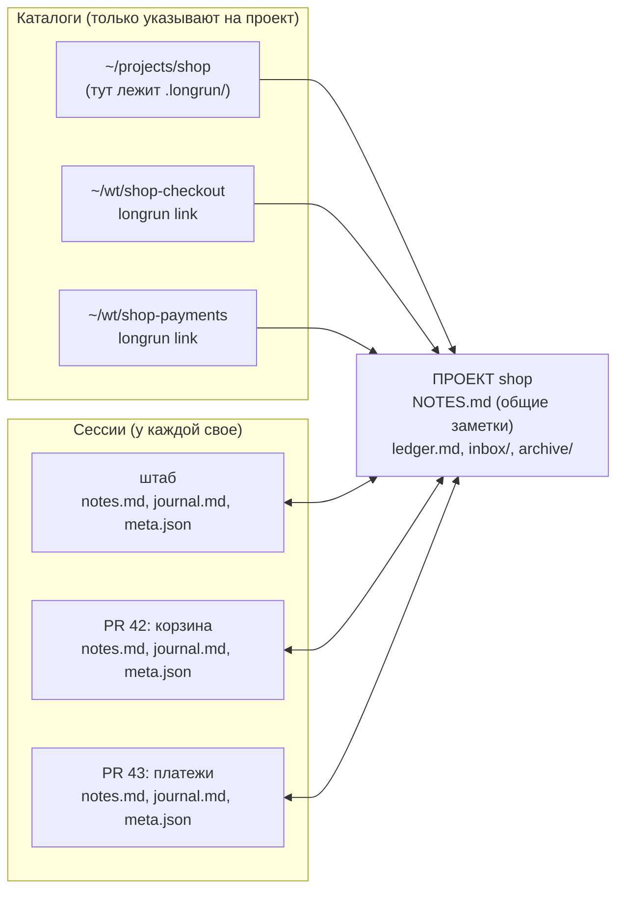

[English](README.md) | Русский

<p align="center">
  
</p>

# longrun - общая память проекта и своя память сессии для Claude Code

Скилл, CLI и 11 хуков. Сессии Claude Code, работающие над одним проектом, видят общую картину и статус друг друга, каждая копит свою часть, которая не теряется при компакции, `/clear` и перезапуске, и при необходимости передают работу той сессии, у которой больше контекста.

Справочник со всеми флагами, форматами и проверенными фактами: [docs/REFERENCE.ru.md](docs/REFERENCE.ru.md). Здесь - устройство. Мини-курс с интерактивными сценариями: `python3 -m http.server 8765 --directory course` и открыть http://localhost:8765/ru/ (английская версия на http://localhost:8765, см. [course/](course/)).

## Зачем

1. **Новая сессия ориентируется сразу.** При старте она получает общие заметки проекта (карта PR, решения, факты об окружении) и список других сессий: кто жив, что делал последним, сколько у кого своих заметок.
2. **Своя часть не пропадает.** Каждая сессия ведет собственные заметки и журнал. Хуки возвращают их в контекст после каждой компакции, после `/clear`, после resume в приложении (даже когда приложение меняет id сессии) и при следующем старте.
3. **Общее актуализируется по ходу.** Сессия пишет в общие заметки то, что нужно другим (`--shared`). Чужие изменения общих заметок приходят каждой работающей сессии на ее следующем ходу, разницей, а не всем файлом.
4. **Работу можно передать.** `longrun send` кладет текст другой сессии как ход пользователя: работающей - сразу, остановленной - при ее следующем ходе. `longrun watch` ждет события (PR влит, время, выкатка) без токенов и будит нужную сессию, когда оно наступило.

Что при этом делает механика, а не модель: архивирует каждое резюме компакции дословно, пишет упавшие команды в журнал, снимает перед компакцией последние просьбы пользователя и правленые файлы, напоминает записать заметку после серии правок.

## Три сущности

| Сущность | Что это | Чем определяется | Что хранит |
|---|---|---|---|
| **Проект** | Общая память группы сессий | Каталог `.longrun/` (в корне репозитория или вне дерева) | Общие заметки, ledger и inbox (опционально), архив |
| **Сессия** | Один разговор Claude Code. В приложении - одна запись в сайдбаре | Первый CLI id сессии; при resume приложение выдает новый id, longrun связывает их по `priorCliSessionIds` | Свои заметки, журнал, счетчики и последний статус |
| **Каталог** | Папка, где сессия стартовала: корень репозитория, worktree, подкаталог, папка с несколькими репозиториями | Путь | Ничего. Только определяет, к какому проекту относится сессия |

Слово "проект" здесь означает ровно каталог `.longrun/` и ничего больше: не каталог с кодом в монорепозитории и не "project" Claude Code (папка транскриптов). Worktree - это каталог: он привязывается к проекту командой `longrun link`, и у него нет своих заметок.



Сессия принадлежит одному проекту. Проект ничего не знает о том, в каком каталоге сессия стартовала, кроме метки `scope` (имя каталога), которая показывается в статусе.

## Файлы

Все общее лежит в каталоге проекта. Все, что принадлежит сессии, лежит вне дерева репозитория и вне синхронизируемых папок, потому что переписывается на каждом вызове инструмента.

```
<проект>/.longrun/                       общее
  NOTES.md          общие заметки [n1], [n2]...; бюджет 5000 байт; у записи есть автор (имя сессии)
  ledger.md         что должен сделать человек (слой HQ, включается отдельно)
  inbox/            сообщения сессиям и рапорты, по файлу на сообщение; .archive/ - доставленные
  config.json       настройки проекта; state.json - счетчики id
  archive/          compact/ (резюме компакций, по сессиям), precompact/ (снимки перед компакцией),
                    notes.md (удаленные общие записи), sessions/ (журналы и умершие сессии)

~/.claude/longrun/sessions/<ключ проекта>/<ключ сессии>/     свое
  notes.md          свои заметки [s1], [s2]...; бюджет 3000 байт
  journal.md        вехи (`longrun log`) и механические строки: FAIL, компакция, старт и конец
  meta.json         счетчики ходов и вызовов, cwd, последний ответ, id в приложении, что из общего уже показано

~/.claude/longrun/                                            глобальное
  registry.json     каталог -> проект (worktree и проекты вне дерева)
  sessions/_index/  CLI id -> проект и ключ сессии
  watch/            отложенные проверки, одна на файл; один launchd-агент на все проекты
```

| Файл | Кто пишет | Когда создается | Когда меняется | Когда удаляется |
|---|---|---|---|---|
| `NOTES.md` проекта | агент: `add --shared`, `rm`, `replace`, `prune --shared` | `longrun init` | по команде; gc архивирует записи старше 14 дней (кроме `pin`) | вручную; `rm` уносит строку в `archive/notes.md` |
| `notes.md` сессии | агент: `add`, `rm`, `replace`, `prune` | первая своя заметка | по команде; gc так же | вместе с сессией, молчавшей 7 дней (в `archive/sessions/`) |
| `journal.md` | хуки и `longrun log` | старт сессии | каждое событие | хвост старше 200 строк в архив; с сессией |
| `meta.json` | хуки, CLI при записи | старт сессии | каждый ход и вызов инструмента | с сессией |
| `archive/compact/*.md` | хук PostCompact | компакция | никогда | старше 30 дней; больше 40 штук |
| `inbox/*.md` | `send`, `watch`, `report`, `ask` | отправка | никогда | при доставке (в `.archive/`), оттуда через 30 дней |
| `watch/w*.json` | `watch add`, тик launchd | регистрация | каждая проверка | через неделю после срабатывания |

## Что происходит

**Старт сессии.** Хук `SessionStart` находит проект по каталогу (вверх по дереву до `.longrun/`, иначе `registry.json`), связывает CLI id с ключом сессии и печатает в контекст дайджест: общие заметки, свои заметки, другие сессии проекта, ожидающие проверки `watch`, ledger (если включен), недоставленные сообщения. Экспортирует `LONGRUN_SESSION` и `LONGRUN_DIR` в Bash сессии, чтобы `longrun add` знал, чья это заметка.

**Работа.** Агент пишет одной строкой по-английски: `longrun add -t dead "..."` в свои заметки, `longrun add --shared -t pin "PR 42 = branch feature/checkout"` в общие, `longrun log "PR opened"` в журнал. Хук `PostToolUse` считает правки, `PostToolUseFailure` пишет упавшую команду в журнал. После 40 вызовов или 8 ходов без записи, и только если были правки или падения, хук один раз напоминает записать.

**Каждый ход.** Хук `UserPromptSubmit` доставляет сообщения из inbox и показывает, что другие сессии изменили в общих заметках с прошлого хода: `+` добавлено, `~` переписано, `-` удалено. Свои записи в общее сессии обратно не показываются.

**Компакция.** `PreCompact` снимает в `archive/precompact/` последние содержательные просьбы пользователя, правленые файлы и недавние FAIL. `PostCompact` кладет резюме компакции в `archive/compact/` дословно. Следующий `SessionStart` (источник `compact`) снова печатает дайджест плюс хвост журнала и блок HANDOFF из снимка.

```mermaid
sequenceDiagram
    participant CC as Claude Code
    participant H as хуки longrun
    participant P as проект (.longrun)
    participant S as сессия (~/.claude/longrun/sessions)
    CC->>H: SessionStart
    H->>P: читает NOTES, inbox, ledger
    H->>S: читает notes, journal; пишет meta
    H-->>CC: дайджест: SHARED + OWN + SESSIONS
    CC->>S: longrun add -t dead "..." (агент)
    CC->>P: longrun add --shared -t pin "..." (агент)
    CC->>H: UserPromptSubmit
    H-->>CC: что изменилось в SHARED с прошлого хода
    CC->>H: PreCompact / PostCompact
    H->>P: снимок, резюме в archive/
    CC->>H: SessionStart(compact)
    H-->>CC: дайджест + HANDOFF + хвост журнала
```

**Resume в приложении.** Приложение поднимает сессию под новым CLI id и записывает старый в `priorCliSessionIds` своего файла метаданных. `SessionStart` (или первый ход, если приложение записало файл позже) находит старый ключ и продолжает тот же каталог сессии: свои заметки и журнал на месте, дайджест помечен "continued". `/clear` в той же папке продолжает сессию, закончившуюся с причиной `clear` минуту назад. Fork получает копию своих заметок родителя и дальше живет отдельно.

**Сообщение другой сессии.** `longrun send "PR 43: платежи" "PR 42 влит, перебазируйся"`. Работает адресат - текст уходит в его сокет и появляется у него как ход пользователя между вызовами инструментов. Остановлен - файл в inbox проекта, который его хуки доставят на следующем вызове инструмента, ходе или старте. `--resume` будит остановленную сессию через `claude -p --resume`. Адресат называется так, как его видит человек: заголовок из сайдбара, имя из реестра Claude Code или префикс id.

**Ожидание события.** `longrun watch add --to "PR 43: платежи" --then "перебазируй" -- pr-merged 42`. Проверку раз в пять минут гонит launchd без модели; когда условие выполнилось, адресат получает сообщение с текстом `--then` теми же путями, что и `send`. Ноутбук спал - проверка догоняет после пробуждения. Три жестких ошибки подряд или истекший срок - одно сообщение "broken" или "expired".

**Уборка.** Раз в час на старте любой сессии: записи старше 14 дней в архив (кроме `pin`), выше 90% бюджета архивируются дешевые `todo` и `ctx` до 80%, журналы обрезаются до 200 строк, сессии, молчавшие неделю, переезжают в `archive/sessions/`, архив старше 30 дней удаляется. `add` при полном бюджете отказывает и называет, что дешевле всего удалить, но сам ничего не вытесняет.

## Что писать и куда

Тест один: **вернет ли это одна команда, `Read` или `grep`?** Если да, не писать.

| Тег | Что | Куда обычно |
|---|---|---|
| `dead` | подход не сработал, и почему | свои; в общие, если туда может зайти другая сессия |
| `decision` | выбор и причина | общие, если касается других |
| `fact` | факт об окружении, который стоил усилий | общие |
| `ctx` | рамки задачи от человека | свои |
| `pin` | факт без срока давности: номер PR, ветка, хост | общие |
| `todo` | короткий хвост за агентом | свои |

Вехи (запушил, PR открыт, тесты зеленые) - в журнал через `longrun log`, не в заметки. То, что переживет задачу (кто пользователь, как он работает), - в автопамять Claude Code, не сюда. Потерялась деталь - сначала `longrun recall <слово>`: ищет по общим и своим заметкам всех сессий, журналам, архивным резюме и транскриптам проекта.

## Оркестратор

Одна сессия проекта берет роль оркестратора (`longrun orchestrate start --goal "..."`, вторая получает отказ с именем держателя) и ведет общую доску `.longrun/board.json`: цель, задачи T<n> со статусами todo / doing / blocked / done / dropped и факты F<n>. Остальные сессии ничего нового не учат, кроме трех команд:

```bash
longrun board take T7                 # взял задачу (оркестратор увидит в inbox)
longrun board done T7 "PR 42 merged"  # закрыл (будит оркестратора)
longrun board block T7 "какое имя поля?"   # вопрос или стена (будит оркестратора)
longrun fact "в ревью просят переименовать поле" --task T7 --source review   # факт извне, сначала записать, потом решать
```

Оркестратор раздает работу (`longrun board assign T8 <сессия>`: живой сессии в сокет, остальным в inbox), разбирает факты (`longrun fact ack F3 "переслал в PR D"`), а в блоке SESSIONS видит флаги без единого токена: `tool \`make test\` 38m`, `turn 71m`, `waiting permission 12m`, `fail x3`, `ctx 262k/300k (87%)`. Их считают хуки (PreToolUse, PostToolUse, Stop, PermissionRequest, Notification) и хвост транскрипта; смотритель раз в 5 минут сообщает оркестратору о превышении порогов, один раз на эпизод.

Рычаги оркестратора: `longrun halt "почему"` запрещает любой инструмент во всех сессиях (хук PreToolUse отвечает отказом с причиной, модель ее видит), `longrun resume` снимает; `longrun interrupt <сессия> --match <текст>` показывает запущенные Bash-процессы сессии, а `--yes` убивает их. Правило: смотритель и оркестратор только предлагают, убивать можно с явного согласия человека в этом разговоре.

Порог контекста задает человек один раз: `/autocompact 300k` (сохраняется в настройках для всех сессий). За 50k до окна хук просит сессию записать заметки и сообщает оркестратору. Заказать компакцию другой сессии нельзя: слэш-команда в сообщении между сессиями не выполняется.

Бюджет 5-часового окна: смотритель раз в 5 минут читает загрузку окна (эндпоинт usage по токену Claude Code из Keychain; при первом обращении нажать "Always Allow") и сравнивает с планом: 20% в час, стоп при полуторакратном превышении. Стоп = тот же `halt` для всех проектов плюс отчет оркестратору и уведомление macOS; `longrun resume` снимает его и усыпляет правило до сброса окна. Смотреть и настраивать: `longrun budget`, `longrun budget set pace 20`, `longrun budget off`.

Вопрос человеку поверх всех окон: `longrun ask "Мержим PR 42?" --options "Да,Нет"` или тул `ask` MCP-сервера `longrun` (в сессии он виден как `mcp__longrun__ask`). Диалог показывает osascript из собственного процесса: без разрешений, поверх окон, со звуком, режим Focus его не прячет. Ответ возвращается сразу, если человек ответил за 90 секунд, иначе позже - ходом в сессию (в сокет; остановленной сессии - в inbox). Cancel или Esc - отказ: вопрос не повторяется, а ставится на доску. Бюджетный стоп тоже показывает диалог с кнопкой Resume all. Правило для сессий: диалог - для того, что не может ждать (подтверждение, доступ, действие только человека), вопросы о цели и приоритетах идут на доску.

Дизайн и что осталось на следующие этапы (автоматические источники фактов) в [docs/ORCHESTRATOR.ru.md](docs/ORCHESTRATOR.ru.md).

## Команды

```bash
longrun init [--external] [--hq]   # сделать каталог проектом; --external: .longrun вне дерева; --hq: ledger и inbox
longrun link <проект>              # из worktree: сессии отсюда относятся к проекту; в worktree ничего не пишется
longrun where                      # какой проект, какая сессия, где файлы
longrun add [--shared] -t TAG "…"  # заметка: своя (s-id) или общая (n-id)
longrun rm s3 n12 | replace s3 "…" | notes [--shared|--own|--session КТО] | prune [--auto] [--shared]
longrun log "веха"                 # строка в журнал сессии
longrun recall слово               # поиск по всему
longrun status                     # сессии проекта: имя, жива ли, свои заметки, последний ответ
longrun send [--list] КТО "текст"  # сообщение сессии
longrun watch add --to КТО --then "…" -- pr-merged 42 | at 10:00 | cmd '…' | file /путь | http URL
longrun ask "вопрос" --options "Да,Нет"   # диалог поверх окон; ответ сразу или ходом позже
longrun onboard [done]                                  # бриф для первого разговора: что делает скилл, нюансы, состояние машины, какие настройки решить
longrun config [set KEY VALUE | unset KEY] [--global]   # настройки: действующие значения и откуда они; см. docs/REFERENCE.ru.md, раздел 6
```

## Установка

```bash
./install.sh            # скилл в ~/.claude/skills/longrun, 11 хуков в ~/.claude/settings.json, CLI в ~/.local/bin/longrun, MCP-сервер longrun (claude mcp add --scope user)
longrun watch install   # launchd-агент com.longrun.watch, раз в 5 минут
longrun init            # в папке проекта; longrun link <проект> из каждого worktree
```

Дальше в сессии Claude Code: "настрой longrun" (или `/longrun onboard`). Агент выполнит `longrun onboard`, перескажет, что делает скилл, спросит про главные настройки (окно автокомпакции, бюджет 5-часового окна, пороги зависания, бюджеты заметок) и применит ответы через `longrun config set`. Окно автокомпакции хук выставить не может: агент попросит ввести `/autocompact 300k` (или выбранное значение) самому.

Установщик копирует файлы в `~/.claude/skills/longrun/`; из репозитория само ничего не подхватывается. После установки новый код хуков и CLI работает во всех сессиях сразу, включая идущие (хук - это отдельный процесс на каждое событие), текст SKILL.md Claude Code перечитывает сам, а новый дайджест сессия увидит при следующем `SessionStart`: после компакции, `/clear`, resume или в новой сессии. Тесты: `tests/run.sh` (регрессия, 145 проверок), `tests/scenarios.sh` (по сценарию на каждую задачу из раздела "Зачем", 30), `tests/orchestrator.sh` (слой оркестратора, 64) и `tests/ask.sh` (диалог и MCP-сервер, 30), без вызовов API и без настоящих диалогов.

Проекты, настроенные версией 0.2, переезжают сами: хранилища worktree с указателем на хаб сворачиваются в проект (их заметки, если были, уходят в `archive/notes.md` проекта), плоские файлы сессий раскладываются по каталогам.

## Границы

- Что модель напишет заметку и вызовет `recall`, гарантирует только инструкция в SKILL.md и напоминания хуков. Механика гарантирует остальное: архив резюме, журнал падений, HANDOFF, возврат заметок в контекст.
- Дайджест ограничен 9000 байт (лимит вывода хука 10000 символов). Порядок вытеснения: список сессий, watch, хвост журнала, HANDOFF, ledger. Заметки не вытесняются никогда, поэтому бюджеты 5000 + 3000.
- Resume в приложении связывается по `priorCliSessionIds` из файлов приложения; `/clear` в CLI - по эвристике "та же папка, конец с причиной clear не позднее трех минут назад". Две сессии, сделавшие `/clear` в одной папке за три минуты, могут перепутаться.
- Под launchd у `/usr/bin/python3` может не быть доступа к `~/Documents` (macOS TCC; наблюдалось после перезапуска приложения, и так будет после перезагрузки). Проверки от этого не зависят, а сообщение сессии проекта из `~/Documents` в таком случае кладется в каталог самой сессии под `~/.claude`, откуда хуки читают его точно так же.
- Формат сокета сессии и транскриптов взят из бинаря и не задокументирован: при смене версии Claude Code первым сломается `send` в работающую сессию (очередь через inbox продолжит работать) и поиск по транскриптам.
- Сабагенты дайджест не получают. Windows не проверялся. `/rewind` заметки не откатывает.

## Частые вопросы

**Агент говорит "PR еще не создан", хотя он есть.** Факт о PR не в общих заметках: после создания PR - `longrun add --shared -t pin "PR X = id, branch ..."`. Сверять с `gh pr view` (или `arc pr status`), не с бордом.

**Сессия в worktree не видит заметок проекта.** `longrun where` должен показать проект. Если показывает "not initialised" - `longrun link <проект>` из этого worktree.

**Сообщение отправлено, а сессия молчит.** `longrun send --list`: адресат "stopped" - сообщение лежит в inbox и придет при следующем ходе. Нужно сейчас - `--resume`.

**Проверка watch не срабатывает.** `longrun watch status` (жив ли launchd, последний тик), `longrun watch ls --all`, `longrun watch test -- <та же проверка>`. Частая причина - относительный путь или alias в `cmd`.
