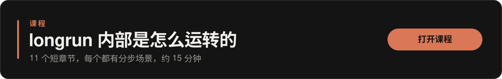
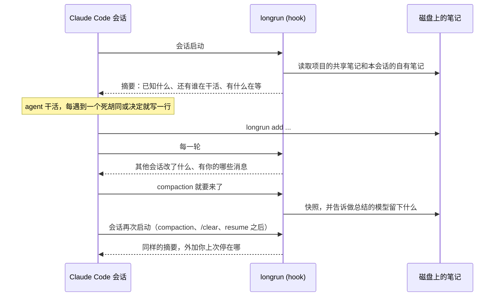

[English](README.md) | [Русский](README.ru.md) | 简体中文 | [日本語](README.ja.md) | [한국어](README.ko.md)

<p align="center">
  
</p>

<h1 align="center">longrun</h1>

<p align="center">
  Claude Code 会话的记忆与协作。<br>
  项目自己把状态记在磁盘上，由 agent 自己写、自己整理。<br>
  每个会话都看得到项目已经知道什么、还有谁在做这个项目。<br>
  活交给手里有上下文的那个会话；等待可靠，而且不花钱。<br>
  一个会话可以带着其余会话走，只有你能拍板时它会找到你。
</p>

<p align="center">
  <a href="#快速开始">快速开始</a> ·
  <a href="#会话协作的四种方式">四种协作方式</a> ·
  <a href="#工作原理">工作原理</a> ·
  <a href="#命令">命令</a> ·
  <a href="docs/REFERENCE.md">参考手册</a> ·
  <a href="https://krllx.github.io/longrun/course/zh-CN/">课程</a>
</p>

<p align="center">
  
  
  
  
  
  
</p>

<p align="center">
  <a href="https://krllx.github.io/longrun/course/zh-CN/"></a>
</p>

---

> 英文版是源文本，内容可能比这一页新。欢迎纠错，见 [docs/TRANSLATION.md](docs/TRANSLATION.md)。

## 快速开始

```bash
curl -fsSL https://krllx.github.io/longrun/install.sh | bash
```

> [!NOTE]
> 安装脚本会装上 skill 和终端里的 `longrun` 命令，把 hook 写进 `~/.claude/settings.json`，并在后台留一个每五分钟跑一次的定时器。还会问你要不要配置桌面通知。`install.sh --uninstall` 把这一切撤回去。

<details>
<summary>安装脚本到底在这台机器上改了什么</summary>

- `~/.claude/settings.json`：11 条 hook 记录，以及两条允许 agent 调用 `longrun` 的权限规则。安装脚本先把这个文件复制到 `~/.claude/backups/`，不是 longrun 的 hook 一概不动。
- `~/.claude/skills/longrun/` 和符号链接 `~/.local/bin/longrun`。
- 用户级 (user scope) 的 MCP 服务器 `longrun` (`claude mcp add`)，`ask` 和 `notify` 这两个工具就是从这儿来的。
- **后台定时器**，每五分钟一次：macOS 上是 launchd agent，Linux 上是 systemd user timer 或 cron 里的一行。它检查你注册的事件监听，并看一眼各个会话：几条 shell 检查而已，不调用模型也不花 token，只有你设的某个条件成立时才唤醒会话。`--no-timer` 跳过这一步。
- **桌面通知**，前提是安装脚本问要不要桌面通知时你回答了“是”：macOS 上在缺少 `terminal-notifier` 时执行 `brew install terminal-notifier`，再发一条测试通知让 macOS 弹出授权。Linux 上只检查有没有 `notify-send`。`--notify` 和 `--no-notify` 可以提前替你回答。

需要 macOS 或 Linux、Claude Code 和 python3 3.9+。从 clone 下来的仓库安装，用的也是同一个 [`install.sh`](install.sh)。

</details>

然后在 Claude Code 里打开一个项目（已经开着的那个就行），说一句 **"set up longrun"**。或者在终端里：

```bash
cd ~/my-project && longrun init && claude "set up longrun"
```

从此什么命令都不用记，直接说就行：“*记一下*”、“*我们都试过什么*”、“*PR 合了告诉我*”。

> **内部怎么运转，还带例子**：[课程](https://krllx.github.io/longrun/course/zh-CN/)，11 个短章节，约 15 分钟。

<details>
<summary><b>桌面通知</b>：有什么用，安装脚本问的是什么</summary>

- **为什么要有**：全部停止、事件监听触发、一轮回答结束，这些事件本来就会送进会话；横幅是为了让*你*在盯着另一个窗口时也能注意到。longrun 从不依赖它们。
- **macOS**：通过 Homebrew 装 `terminal-notifier`（系统自带的工具都弹不出横幅），外加一次授权弹窗。安装时回答了“否”？以后再跑 `brew install terminal-notifier`。
- **Linux**：`notify-send` (`libnotify`)，大多数桌面环境已经有了。

`longrun notify --test` 检查通知是否真的到了屏幕上。有两个设置值得看看：`notify_turn_end unfocused`（Claude 窗口不在前台时，会话每结束一轮就弹一条横幅）和 `longrun important on|next`，用于你绝对不能错过的那个会话。agent 调用的 `notify` 工具来自安装脚本注册的 `longrun` MCP 服务器。完整说明，包括 macOS 的各种怪癖：[docs/REFERENCE.md](docs/REFERENCE.md)。

</details>

## 一句话概括

**不用你开口，从第一个会话起就有**：项目把一组笔记记在磁盘上，由 agent 自己写、自己重读、自己清理，记的是死胡同、决定和事实。每个会话一上来就知道笔记里有什么、还有哪些会话在、各自最后做了什么，之后每一轮都显示其他会话在这期间改了什么。

**你开口，或者 agent 自己看出需要时**：活交给手里已经有上下文的那个会话；“PR 合了告诉我”变成一项事件监听，等待期间不花 token，也不会漏掉事件；你绝对不能错过的那个会话有动静时，通知会找到你；一个会话带着其余会话走向既定目标，碰到只有你能解开的事，就把对话框摆到你面前。

**顺带还有一层**：磁盘上的笔记不会退化，所以每次 compaction（对话历史被自动摘要）、`/clear` 和 resume 之后 hook 都把它们带回来。这一层已经不像从前那么要紧了：同一批 hook 现在还会告诉做总结的模型该留下什么，所以一次普通的 compaction 本身就比过去丢得少。

## 为什么

| 没有 longrun | 有了 longrun |
|---|---|
| 一个会话琢磨出来的一切，都只留在那一次对话里。下一个会话，明天那个也好、另一个窗口里那个也好，都从零开始，还要回头问你现在是什么情况。 | **一个记得住事的项目**。每个项目一个 `.longrun/`：笔记由 agent 自己写、自己重读、自己清理。每个会话一上来就拿到这些笔记，外加还有谁在干活、各自最后做了什么。 |
| 第二个会话根本不知道第一个存在。一个已经开了 PR，另一个还在说“PR 还没建”。 | **消息和任务**。活交给手里已经有上下文的那个会话，到了那边是一轮用户输入。已经停了的会话也一样：消息在项目收件箱里等着。 |
| “PR 合了告诉我”要么变成烧 token 的轮询循环，要么变成一段定时的 sleep，醒来时事件不是早已发生，就是还没到。 | **事件监听**。后台定时器每五分钟检查一次条件，不调用模型，条件成立就唤醒会话。可靠、及时、还不花钱。 |
| 五个会话在一个项目上，只有你自己知道什么做完了、什么卡住了、下一步是什么，也只有你会注意到其中某个会话正在等你。 | **编排器**。一个会话替其余会话维护任务板，发现卡住的同伴，只有你能拍板时，把对话框摆到所有窗口之上。 |
| compaction 把历史压成一段总结，最先丢掉的就是各个决定背后的原因：为什么放弃了某个做法、为什么选了这条路。 | **磁盘上的笔记不会退化**，compaction 之后 hook 会把它们重新送回来。hook 还会告诉做总结的模型该留下什么，所以 compaction 本身也丢得更少。 |

一个 python 文件，没有依赖。

## 有几件事 Claude Code 自己已经能做

longrun 管的是比一轮对话、比一个会话活得更久的东西。能用内置的，就先用内置的：

- **一个会话朝着一个可检验的条件干活** -> `/goal`：它让那个会话一直干下去，直到一个独立的评估器确认条件成立。longrun 有任务板，也会劝，但没有评估器。
- **把一轮之内的活拆开** -> subagent 和 workflow：并行、汇合，这一轮结束就没了。
- **比任务本身活得更久的东西**，比如你是谁、你怎么干活、长期沿用的约定 -> Claude Code 的自动记忆。
- **给此刻正在运行的会话发消息** -> 内置的 `SendMessage`；`ListAgents` 列出哪些会话在运行。
- **好几个窗口，跨小时跨天** -> longrun：比每一轮活得更久的状态、停了也照样能写信的会话、不花 token 的等待，以及一个会话协调其余会话。

## 会话协作的四种方式

> [!NOTE]
> 下面这些命令是 agent 自己会跑的：skill 会告诉它什么时候写笔记、什么时候发消息、什么时候设一个事件监听。这里没有一条需要你背下来：你只要说“*记一下*”或者“*PR 合了告诉我*”，甚至什么都不用说。列出来只是因为想手动跑的时候，任何一条都能跑。

### 1. 磁盘上的共享文档

每个项目有一个 `.longrun/`，里面放着所有会话都看得到的笔记，一条笔记默认就写到这里。会话想把某条只留给自己，就加 `--own`，存到仓库目录树之外。每次 compaction、`/clear` 和 resume 之后 hook 会把两者都带回来，并在每一轮显示其他会话改了什么。

```bash
longrun add -t pin "PR 42 = branch feature/checkout"           # shared: every session sees it
longrun add --own -t ctx "only the checkout drawer, not the cart"  # this conversation only
longrun doc add research/plan.md "the rollout plan and what is open"
longrun recall 429                                             # notes, those files, journals, transcripts
```

### 2. 把活交给手里有上下文的那个会话

发给另一个会话的消息，在那边是一轮用户输入。正在运行的会话通过自己的 socket 立刻收到。已经停了的会话则在下一轮从项目收件箱里收到；只有你加上 `--resume` 才会立刻把它叫醒，那是后台的一次 `claude -p` 运行，要花 token。会话的名字就是你在侧边栏看到的标题。

这里的前一半 Claude Code 自己就能做：`SendMessage` 写给**正在运行**的会话，`ListAgents` 列出哪些在运行。`longrun send` 补上的是剩下的一半：已经停了的会话（消息在收件箱里等着）、按侧边栏标题而不是会话 id 称呼对方、用 `--resume` 在后台叫醒一个会话。事件监听触发和任务板派活走的也是这条路，而它们背后没有模型去调用工具。

```bash
longrun send "PR 43: payments" "PR 42 merged, rebase onto main"
longrun board assign T8 "PR 43: payments"      # a task instead of a message
```

### 3. 事件驱动：等待不花 token

事件监听就是一项检查，里面没有模型的判断，由定时器每五分钟跑一次（macOS 上是 launchd agent，Linux 上是 systemd user timer 或一个 cron 任务）。条件成立时，会话会以消息的形式收到 `--then` 里的那段文字。笔记本电脑休眠只是让检查晚一点做。

```bash
longrun watch add --to "PR 43: payments" --then "rebase onto main" -- pr-merged 42
longrun watch add --then "check the deploy" -- at 10:00
```

可用的检查：`pr-merged`（通过 `gh` 查 GitHub）、`pr-status`、`at`、`file`、`http`、`cmd`。

### 4. 一个会话协调其余会话，该找你的时候找你

一个会话接过编排器的角色并维护一块任务板：目标、任务、来自外部的事实。干活的会话负责领取任务、完成任务，或者把任务标为阻塞。任务板上的每一次变动都会唤醒编排器，由它派出下一个任务、解开阻塞，或者通过盖在所有窗口之上的对话框问你。它不轮询，也不自己开会话：在桌面应用里它留下一个按钮 (chip)，你点一下就打开一个会话；在终端里它把第一行准备好，你自己粘贴进去。

这是跨多个窗口的协调，再加上一条随时能问到你的通道，不是自治：把**一个**会话推到某个评估器能检验的条件上，那是 `/goal` 的事。

```bash
longrun orchestrate start --goal "ship the checkout drawer"    # in the coordinating session
longrun board take T7; longrun board done T7 "PR 42 merged"    # in a worker
longrun board add --fact "reviewer wants the field renamed"    # something learned outside
longrun ask "Merge PR 42?" --options "Yes,No"                  # a dialog, answered inline
```

控制权始终握在你手里。编排器和监视器只负责提议：它们能给会话发消息、把一个问题摆到你面前，也能用 `longrun halt` 一次停下所有会话，而这个停止只有你能解除。没有任何东西会去杀掉正在跑的工具；卡住的那个窗口，由你自己按 Esc 停下。

## 工作原理



**启动**。hook 按目录找到项目并打印摘要：共享笔记、自有笔记、其他会话（是否还活着、各自最后干了什么）、待触发的事件监听、未送达的消息。

**干活**。agent 每碰到一个死胡同、做出一个决定或拿到一条来之不易的事实，就写一行。hook 统计编辑次数并记录失败的命令。连着编辑了很久却一条笔记都没写，会提醒 agent 记一条。

**每一轮**。投递收件箱里的消息。其他会话对共享笔记做的改动以差异形式出现：`+` 新增、`~` 改写、`-` 删除。

**compaction**。compaction 之前，先给最近的请求、编辑过的文件和最近的失败拍一张快照，外加给做总结的模型的指示：保留死胡同连同原因、保留精确字符串、丢掉读一次文件就能拿回来的东西。自动 compaction 和 `/compact <text>` 在 Claude Code 里用的是同一段总结提示词，所以这和你自己写 `/compact` 提示是一回事，只是由 longrun 替你写好，也不用你算时机。compaction 之后，longrun 把那段总结原样归档。下一次启动打印的是摘要加一个 HANDOFF 区块，于是会话从上次停下的地方继续。resume 和 `/clear` 沿用同一批笔记；fork 出来的会话拿到一份副本。

**清理**。每小时一次：旧条目进归档（`pin` 除外）、日志只留尾巴、长期沉默的会话进归档。笔记预算满了 `add` 会拒绝，并指出可以删掉哪些。不会悄悄丢掉任何东西。

## 三个实体

| 实体 | 是什么 | 存什么 |
|---|---|---|
| **项目** | 一个 `.longrun/` 目录，位于项目文件夹里，或者在目录树之外 (`--external`) | 共享笔记、收件箱、任务板、归档 |
| **会话** | 一次 Claude Code 对话；在应用里就是侧边栏的一行。resume 会拿到新的 id，longrun 把旧 id 和新 id 串起来 | 自有笔记、日志、计数器、最后状态 |
| **目录** | 会话启动时所在的文件夹：仓库根目录、worktree、子目录 | 什么都不存。只说明这个会话属于哪个项目 |

worktree 用 `longrun link <project>` 挂上去，本身不存放笔记。

## 该写什么

只有一个判据：**一条命令、读一次文件或一次 grep 能不能把它找回来**？能的话，就别写。一行装不下？那它就该是一个文件，笔记里只留一行指向它：`longrun doc add research/plan.md "the rollout plan and what is still open"`。每个会话在每次启动时都看得到这一行，真需要时才去打开那个文件。

| 标签 | 写什么 | 写到哪 |
|---|---|---|
| `dead` | 失败的做法，以及为什么失败 | 自有；如果别的会话也可能撞上同一个死胡同，就写共享 |
| `decision` | 选择及其理由 | 与别人有关就写共享 |
| `fact` | 一条花了力气才弄清的环境事实 | 共享 |
| `pin` | 不会过期的事实：PR 号、分支、主机 | 共享 |
| `ctx` | 你给出的任务背景 | 自有 |
| `doc` | 指向文件的一行，那个文件长得放不进一条笔记：`longrun doc add <path> "what is in it"` | 共享 |

一条不再成立的笔记，不会背着大家删掉：`longrun stale n12 "staging moved to vla-07"` 给它打上“已经不成立”的标记，每个会话都看得到这个标记，下一次清理先拿标记过的条目开刀。`longrun mute n12` 只是把一条从*你自己*的摘要里去掉，对别人什么都不改。

机械性的记录，日志自己会记：改了什么、什么失败了、什么时候做过 compaction，所以进度汇报不用写进笔记。比任务存在更久的东西（用户是谁、他怎么干活）写进 Claude Code 的自动记忆，而不是 longrun。

## 命令

```bash
longrun init [--external] | link <project> | where | onboard | config
longrun add [--own] -t TAG "..." | rm | replace | stale | mute | notes | prune | recall <term>
longrun doc add <path> "what is in it" | doc ls | doc touch n12 "..." 
longrun status | send [--list] [--resume] WHO "..."
longrun watch add --to WHO --then "..." -- pr-merged 42 | at 10:00 | cmd '...' | file /path | http URL
longrun orchestrate start --goal "..." | board [add --fact|ack] | ask | halt | resume
```

完整的参数、文件格式和关于 Claude Code 的已验证事实：[docs/REFERENCE.md](docs/REFERENCE.md)。编排器的设计和还没做的部分：[docs/ORCHESTRATOR.md](docs/ORCHESTRATOR.md)。

<!-- site: nuances, limits and edge cases move to the site; add the link here -->

<details>
<summary><b>常见问题</b></summary>

**PR 明明在，agent 却说“PR 还没建”**。这条事实不在共享笔记里：`longrun add -t pin "PR 42 = branch feature/checkout"`。

**worktree 里的会话看不到项目笔记**。`longrun where` 必须能显示出项目。如果输出是 "not initialised"：在那个 worktree 里跑 `longrun link <project>`。

**消息发出去了，会话却没动静**。`longrun send --list`：收件人是 "stopped" 就说明消息在收件箱里，它下一轮才会拿到。要它现在就拿：`--resume`。

**事件监听一直不触发**。`longrun watch status`、`longrun watch ls --all`、`longrun watch test -- <the same check>`。常见原因是 `cmd` 里用了相对路径或 shell 别名。
</details>

## 开发

```bash
bash tests/run.sh            # 211 regression checks, no API calls
bash tests/scenarios.sh      # 37 scenarios, one per goal
bash tests/orchestrator.sh   # 51: the orchestrator layer
bash tests/ask.sh            # 27: the dialog and the MCP server
```

安装脚本把文件复制到 `~/.claude/skills/longrun/`；运行时不会从 checkout 里加载任何东西。正在运行的会话不用重启也能用上更新，因为每个事件的 hook 都是一个单独的进程。

## 许可证

[MIT](LICENSE)
