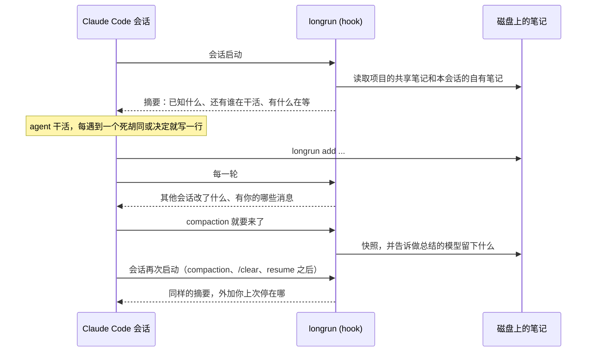

[English](README.md) | [Русский](README.ru.md) | 简体中文

<p align="center">
  
</p>

<h1 align="center">longrun</h1>

<p align="center">
  给 Claude Code 会话的记忆与协作。<br>
  笔记在 compaction（对话历史被自动摘要）之后依然还在。会话之间互相发消息、互相派任务。<br>
  等待不会睡过头：没有轮询循环，事件发生时会话自己醒来。<br>
  一个会话带着其余会话走向目标。
</p>

<p align="center">
  <a href="#快速开始">快速开始</a> ·
  <a href="#会话协作的四种方式">四种协作方式</a> ·
  <a href="#工作原理">工作原理</a> ·
  <a href="#命令">命令</a> ·
  <a href="docs/REFERENCE.md">参考手册</a> ·
  <a href="https://krllx.github.io/longrun/course/zh-CN/">课程</a>
</p>

<p align="center">
  
  
  
  
  
  
</p>

<p align="center">
  <a href="https://krllx.github.io/longrun/course/zh-CN/"></a>
</p>

---

> 英文版是源文本，可能比这一页更新。欢迎纠错，见 [docs/TRANSLATION.md](docs/TRANSLATION.md)。

## 快速开始

```bash
curl -fsSL https://raw.githubusercontent.com/krllx/longrun/main/install.sh | bash
```

> [!NOTE]
> 安装脚本会装上 skill 和终端里的 `longrun` 命令，把 hook 写进 `~/.claude/settings.json`，并在后台留一个每五分钟跑一次的定时器。配置桌面通知之前它会先问你。`install.sh --uninstall` 把这一切撤回去。

<details>
<summary>它到底在这台机器上改了什么</summary>

- `~/.claude/settings.json`：11 条 hook 记录，以及两条允许 agent 调用 `longrun` 的权限规则。longrun 先把这个文件复制到 `~/.claude/backups/`，不属于我们的 hook 一概不动。
- `~/.claude/skills/longrun/` 和符号链接 `~/.local/bin/longrun`。
- 用户级 (user scope) 的 MCP 服务器 `longrun` (`claude mcp add`)，`ask` 和 `notify` 这两个工具就是从这儿来的。
- **一个后台定时器**，每五分钟一次：macOS 上是 launchd agent，Linux 上是 systemd user timer 或一行 cron。它检查你注册的事件监听，并看一眼各个会话：几条 shell 检查而已，不调用模型也不花 token，只有你的某个条件成立时才唤醒会话。`--no-timer` 跳过这一步。
- **桌面通知**，前提是你对那个问题回答了“是”：macOS 上在缺少 `terminal-notifier` 时执行 `brew install terminal-notifier`，在 `~/.claude/longrun/notifier/` 下放一个发送用的 bundle，再发一条测试通知让 macOS 弹出授权。Linux 上只检查有没有 `notify-send`。`--notify` 和 `--no-notify` 可以提前替你回答。

需要 macOS 或 Linux、Claude Code 和 python3 3.9+。从 clone 出来的仓库装也是同一个 [`install.sh`](install.sh)。

</details>

然后在 Claude Code 里打开一个项目（已经开着的那个就行），说一句 **"set up longrun"**。或者在终端里：

```bash
cd ~/my-project && longrun init && claude "set up longrun"
```

从此什么命令都不用记，直接说就行：*“记一下”*、*“我们都试过什么”*、*“PR 合了告诉我”*。

> **内部怎么运转，还带例子：**[课程](https://krllx.github.io/longrun/course/zh-CN/)，11 个短章节，约 15 分钟。

<details>
<summary><b>桌面通知</b>：它们有什么用，安装脚本又问了什么</summary>

- **为什么要有：**全部停止、事件监听触发、一轮回答结束，这些本来就会传到会话里；横幅是为了让*你*在盯着另一个窗口时也能注意到。longrun 从不依赖它们。
- **macOS：**通过 Homebrew 装 `terminal-notifier`（系统自带的东西都画不出横幅），外加一次授权弹窗。安装时回答了“否”？以后再 `longrun notify setup`。
- **Linux：**`notify-send` (`libnotify`)，大多数桌面环境已经有了。

`longrun notify --test` 检查通知是否真的到了屏幕上。有两个设置值得看看：`notify_turn_end unfocused`（Claude 窗口不在前台时，会话每结束一轮就弹一条横幅）和 `longrun important on|next`，用于那个你绝对不能错过的会话。agent 调用的 `notify` 工具来自安装脚本注册的 `longrun` MCP 服务器。完整说明，包括 macOS 的各种怪癖：[docs/REFERENCE.md](docs/REFERENCE.md)。

</details>

## 一句话概括

**不用你开口，从第一个会话起就有的：**agent 把笔记写到磁盘上（死胡同、决定、事实），每次 compaction、`/clear` 和 resume 之后 hook 都把它们带回来；compaction 时会告诉做总结的模型该留下什么；每一轮都显示项目里其他会话改了什么。

**你开口，或者 agent 自己看出需要时：**“PR 合了告诉我”（一个等待时不花 token 的事件监听）、会话之间的消息和任务、你在意的那个会话干完时发条通知、一个会话带着其他会话走向目标。

## 为什么

| 没有 longrun | 有了 longrun |
|---|---|
| compaction 把历史压成一段总结，最先丢掉的就是原因。半小时后 agent 又提出了它自己已经回退掉的那个改法。 | **笔记在磁盘上。**每条死胡同、决定和事实各占一行。共享笔记每个会话都看得到，自有笔记在每次 compaction、`/clear` 和 resume 之后回来。 |
| 第二个会话根本不知道第一个存在。一个已经开了 PR，另一个还在说“PR 还没建”。 | **消息和任务。**一个会话发出消息或派出任务，它会作为一轮用户输入落到另一个会话里。 |
| “PR 合了告诉我”要么变成烧 token 的轮询循环，要么变成睡过头的 sleep。 | **事件监听。**launchd 每五分钟检查一次条件，不调用模型，条件成立就唤醒会话。可靠、及时、还不花钱。 |
| 五个会话在一个项目上，只有人自己知道什么做完了、什么卡住了、下一步是什么。 | **一个编排器。**一个会话维护任务板、派发任务、发现卡住的同伴，只在必要时才通过对话框问人。 |

一个 python 文件，没有依赖。

## 会话协作的四种方式

> [!NOTE]
> 下面这些命令是 agent 自己会跑的：skill 会告诉它什么时候写笔记、什么时候发消息、什么时候设一个事件监听。这里没有一条需要你背下来：你只要说*“记一下”*或者*“PR 合了告诉我”*，甚至什么都不说。列出来只是因为你想手动跑的时候随时可以跑。

### 1. 磁盘上的共享文档

每个项目有一个 `.longrun/`，里面放着所有会话都看得到的笔记。每个会话另外还有自己的笔记，存在仓库目录树之外。每次 compaction、`/clear` 和 resume 之后 hook 会把两者都带回来，并在每一轮显示其他会话改了什么。

```bash
longrun add --shared -t pin "PR 42 = branch feature/checkout"     # for every session
longrun add -t dead "retry on 429 does not help, limit is per org"  # for this one
longrun recall 429                                                  # search everything
```

### 2. 把活交给手里有上下文的那个会话

发给另一个会话的消息，在那边是一轮用户输入。正在运行的会话通过它的 socket 立刻收到。已经停了的会话则在下一轮从项目收件箱里取走；只有你加上 `--resume` 才会立刻把它叫醒，那是后台的一次 `claude -p` 运行，要花 token。会话的名字就是你看到的样子：侧边栏标题。

```bash
longrun send "PR 43: payments" "PR 42 merged, rebase onto main"
longrun board assign T8 "PR 43: payments"      # a task instead of a message
```

### 3. 响应式：等待不花 token

事件监听就是一段确定性的检查，由定时器每五分钟跑一次，全程不调用模型（macOS 上是 launchd agent，Linux 上是 systemd user timer 或一个 cron 任务）。条件成立时，会话会以消息的形式收到那段文字。笔记本睡眠只是让检查晚一点做。

```bash
longrun watch add --to "PR 43: payments" --then "rebase onto main" -- pr-merged 42
longrun watch add --then "check the deploy" -- at 10:00
```

可用的检查：`pr-merged`（通过 `gh` 查 GitHub）、`pr-status`、`at`、`file`、`http`、`cmd`。

### 4. 有选择的自治：一个会话带着其余会话

一个会话接过编排器的角色并维护一块任务板：目标、任务、来自外部的事实。干活的会话负责领取、完成和阻塞任务。每一次动作都会唤醒编排器，由它派出下一个任务、解开阻塞，或者通过一个盖在所有窗口之上的对话框来问你。它不轮询，也不自己开会话：会话由你打开，第一句话由它准备好，你自己粘贴进去。

```bash
longrun orchestrate start --goal "ship the checkout drawer"    # in the driving session
longrun board take T7; longrun board done T7 "PR 42 merged"    # in a worker
longrun ask "Merge PR 42?" --options "Yes,No"                  # a dialog, answered inline
```

开关始终握在人手里：打断卡住的进程 (`longrun interrupt`)、全部停止 (`longrun halt`)、解除停止。监视器和编排器只负责提议。还有一条默认关闭、要你自己打开的规则：5 小时用量预算 (`longrun budget on`)，当这个窗口的消耗跑在计划前面时全部停止，并问你接下来怎么办。

## 工作原理



**启动。**hook 按目录找到项目并打印摘要：共享笔记、自有笔记、其他会话（是否还活着、各自最后干了什么）、待触发的事件监听、未送达的消息。

**干活。**agent 每碰到一个死胡同、做出一个决定或拿到一条来之不易的事实，就写一行。hook 统计编辑次数并记录失败的命令。连着编辑了很久却一条笔记都没写，会收到一次提醒。

**每一轮。**投递收件箱里的消息。其他会话对共享笔记做的改动以差异形式出现：`+` 新增、`~` 改写、`-` 删除。

**compaction。**在它之前，先给最近的请求、编辑过的文件和最近的失败拍一张快照，外加给做总结的模型本人的指示：保留死胡同连同原因、保留精确字符串、丢掉一次 Read 就能拿回来的东西。自动 compaction 和 `/compact <text>` 在 Claude Code 里用的是同一段总结提示词，所以这和你自己写 `/compact` 提示是一回事，只是由 longrun 替你写好，也不用你算时机。compaction 之后，longrun 把那段总结原样归档。下一次启动打印的是摘要加一个 HANDOFF 区块，于是会话接着原地继续。resume 和 `/clear` 沿用同一批笔记；fork 出来的会话拿到一份副本。

**清理。**每小时一次：旧条目进归档（`pin` 除外）、日志只留尾巴、长期沉默的会话进归档。预算满了 `add` 会拒绝，并指出可以删掉哪些。什么都不会被悄悄丢掉。

## 三个实体

| 实体 | 是什么 | 存什么 |
|---|---|---|
| **项目** | 一个 `.longrun/` 目录，位于项目文件夹里，或者在目录树之外 (`--external`) | 共享笔记、收件箱、任务板、归档 |
| **会话** | 一次 Claude Code 对话；在应用里就是侧边栏的一行。resume 会拿到新的 id，longrun 把它们串起来 | 自有笔记、日志、计数器、最后状态 |
| **目录** | 会话启动时所在的文件夹：仓库根目录、worktree、子目录 | 什么都不存。它只说明这个会话属于哪个项目 |

worktree 用 `longrun link <project>` 挂上去，本身没有笔记。

## 该写什么

只有一个判据：**一条命令、一次 Read 或一次 grep 能不能把它找回来？**能的话，就别写。

| 标签 | 写什么 | 写到哪 |
|---|---|---|
| `dead` | 失败的做法，以及为什么失败 | 自有；别的会话也可能一头撞上去就写共享 |
| `decision` | 一个选择和它的理由 | 与别人有关就写共享 |
| `fact` | 一条花了力气才弄清的环境事实 | 共享 |
| `pin` | 不会过期的事实：PR 号、分支、主机 | 共享 |
| `ctx` | 人给出的任务背景 | 自有 |
| `todo` | agent 欠下的一件小尾巴 | 自有 |

里程碑（已推送、PR 已开、测试变绿）写进日志：`longrun log "PR opened"`。比任务活得更久的东西（用户是谁、他怎么干活）写进 Claude Code 的自动记忆，不写这里。

## 命令

```bash
longrun init [--external] | link <project> | where | onboard | config
longrun add [--shared] -t TAG "..." | rm | replace | notes | prune | log "..." | recall <term>
longrun status | send [--list] [--resume] WHO "..."
longrun watch add --to WHO --then "..." -- pr-merged 42 | at 10:00 | cmd '...' | file /path | http URL
longrun orchestrate start --goal "..." | board | fact | ask | halt | resume | interrupt | budget
```

完整的参数、文件格式和已验证的事实：[docs/REFERENCE.md](docs/REFERENCE.md)。编排器的设计和还没做的部分：[docs/ORCHESTRATOR.md](docs/ORCHESTRATOR.md)。

<!-- site: nuances, limits and edge cases move to the site; add the link here -->

<details>
<summary><b>常见问题</b></summary>

**PR 明明在，agent 却说“PR 还没建”。**这条事实不在共享笔记里：`longrun add --shared -t pin "PR 42 = branch feature/checkout"`。

**worktree 里的会话看不到项目笔记。**`longrun where` 必须能显示出项目。如果它说 "not initialised"：在那个 worktree 里跑 `longrun link <project>`。

**消息发出去了，会话却没动静。**`longrun send --list`：收件人是 "stopped" 就说明消息在收件箱里，它下一轮才会拿到。要它现在就拿：`--resume`。

**事件监听一直不触发。**`longrun watch status`、`longrun watch ls --all`、`longrun watch test -- <the same check>`。常见原因是 `cmd` 里用了相对路径或 shell 别名。
</details>

## 开发

```bash
bash tests/run.sh            # 202 regression checks, no API calls
bash tests/scenarios.sh      # 30 scenarios, one per goal
bash tests/orchestrator.sh   # 67: the orchestrator layer
bash tests/ask.sh            # 30: the dialog and the MCP server
```

安装脚本把文件复制到 `~/.claude/skills/longrun/`；不会从 checkout 里加载任何东西。正在运行的会话不用重启也能用上更新，因为每个事件的 hook 都是一个单独的进程。

## 许可证

[MIT](LICENSE)
